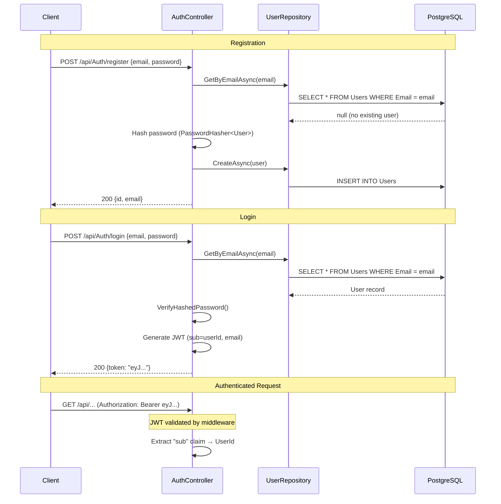
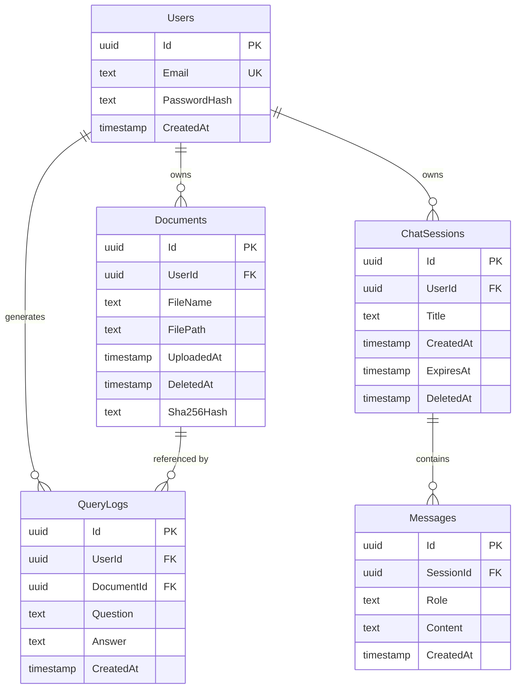
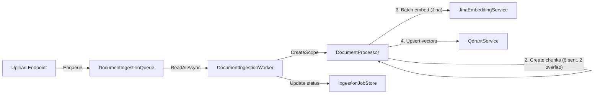
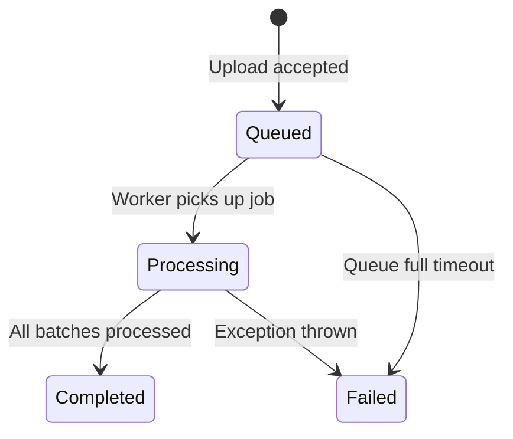
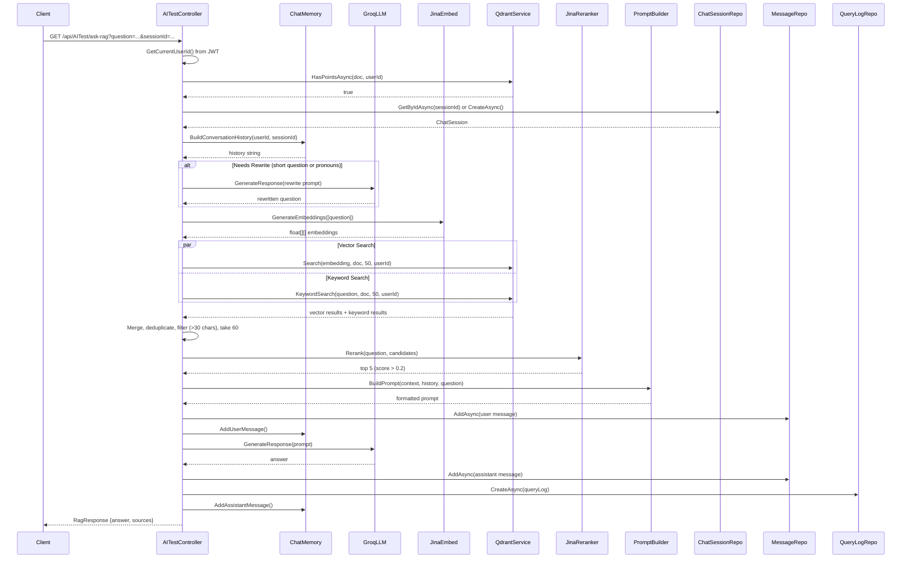
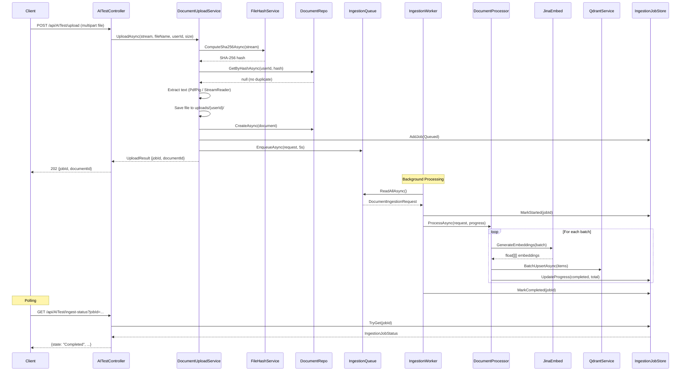
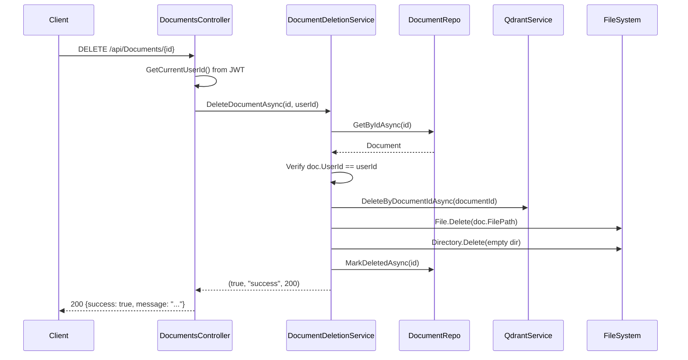
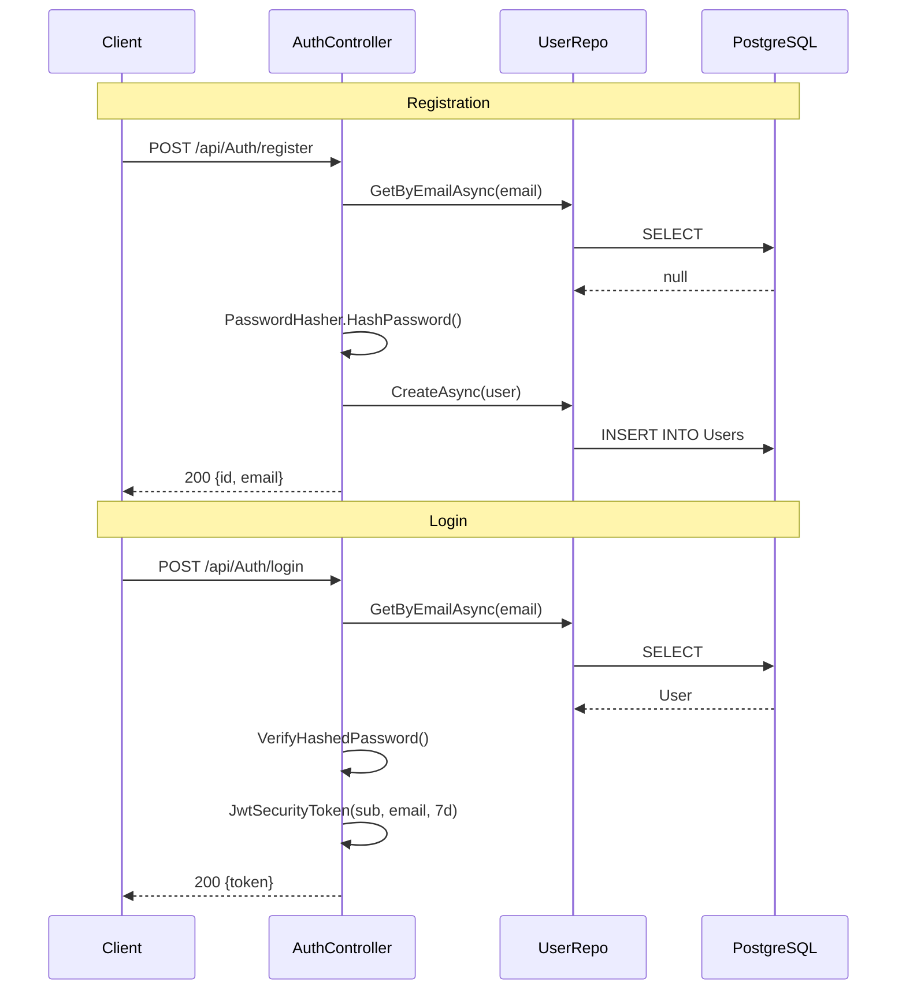
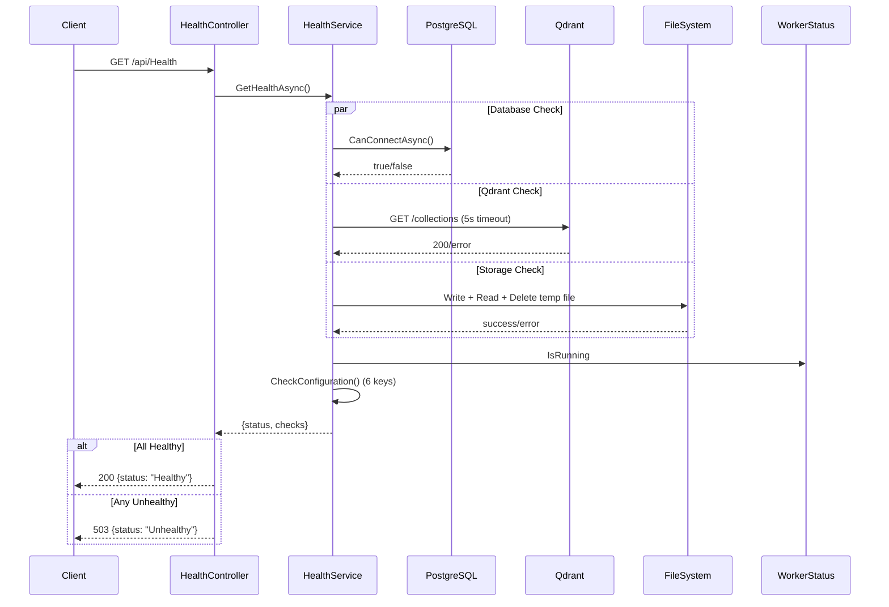

# LocalRagAPI — Backend Documentation

> **Generated from source code analysis — not guesswork.**
> Every statement is cross-referenced to actual files in this repository.

---

# 1. Project Overview

## Purpose

LocalRagAPI is a **Retrieval-Augmented Generation (RAG)** backend API that allows users to upload documents (PDF/TXT), have them chunked and embedded into a vector store, and then ask natural-language questions that are answered using context retrieved from those documents via an LLM.

## Architecture

The application follows a layered architecture:

```
Controllers → Services → Repositories → Database (PostgreSQL)
                ↓
         External APIs (Groq LLM, Jina Embeddings, Jina Reranker, Qdrant Vector DB)
```

- **Controllers** handle HTTP requests and produce responses.
- **Services** contain business logic, AI integrations, and document processing.
- **Repositories** abstract database access via Entity Framework Core.
- **Background Workers** process document ingestion asynchronously via a channel-based queue.

## Tech Stack

| Layer | Technology |
|---|---|
| Runtime | .NET 8.0 (ASP.NET Core) |
| Language | C# |
| Database | PostgreSQL (via Npgsql + EF Core 8) |
| Vector Store | Qdrant (REST API) |
| LLM | Groq API (`llama-3.1-8b-instant`) |
| Embeddings | Jina AI (`jina-embeddings-v2-base-en`, 768-dim) |
| Reranking | Jina AI (`jina-reranker-v1-base-en`) |
| Authentication | JWT Bearer (HMAC-SHA256) |
| PDF Parsing | PdfPig (UglyToad) |
| Containerization | Docker |
| CI/CD | GitHub Actions |
| API Docs | Swagger / Swashbuckle (development only) |

### NuGet Packages

Referenced in [LocalRagAPI.csproj](file:///c:/Users/anshm/source/repos/LocalRagAPI/LocalRagAPI/LocalRagAPI.csproj):

| Package | Version |
|---|---|
| `Microsoft.AspNetCore.Authentication.JwtBearer` | 8.0.3 |
| `Microsoft.EntityFrameworkCore` | 8.0.0 |
| `Npgsql.EntityFrameworkCore.PostgreSQL` | 8.0.0 |
| `Microsoft.EntityFrameworkCore.Tools` | 8.0.0 |
| `Microsoft.EntityFrameworkCore.Design` | 8.0.0 |
| `Swashbuckle.AspNetCore` | 6.6.2 |
| `Qdrant.Client` | 1.9.0 |
| `PdfPig` | 0.1.13 |
| `LLamaSharp` | 0.26.0 |
| `Microsoft.SemanticKernel` | 1.73.0 |
| `Tokenizers.DotNet` | 1.4.0 |

## Folder Structure

```
LocalRagAPI/
├── .github/
│   └── workflows/
│       └── ci-cd.yml                    # GitHub Actions CI/CD pipeline
├── Controllers/
│   ├── AITestController.cs              # Core RAG endpoints (ask, upload, chat, stream)
│   ├── AuthController.cs                # Register & Login
│   ├── DemoController.cs                # Demo knowledge base initialization
│   ├── DocumentsController.cs           # Document CRUD, preview, download
│   ├── HealthController.cs              # Health check endpoint
│   └── SessionsController.cs            # Chat session CRUD
├── Data/
│   └── ApplicationDbContext.cs          # EF Core DbContext
├── DemoDocuments/
│   └── Demo Guide.pdf                   # Pre-bundled demo document
├── Middleware/
│   ├── ErrorHandlingMiddleware.cs       # Global exception handler
│   └── RequestLoggingMiddleware.cs      # Request timing logger
├── Migrations/
│   ├── 20260313065955_init.cs           # Users + Documents tables
│   ├── 20260313081457_AddChatAndAudit.cs# ChatSessions, Messages, QueryLogs
│   ├── 20260313120000_AddSessionDeletedAt.cs  # DeletedAt on ChatSessions
│   ├── 20260315135111_addDeleteColumn.cs      # Duplicate (no-op)
│   ├── 20260731032217_AddDocumentSha256Hash.cs # Sha256Hash + unique index
│   └── ApplicationDbContextModelSnapshot.cs
├── Models/
│   ├── ChatMessage.cs                   # In-memory chat message DTO
│   ├── ChatRequest.cs                   # Chat endpoint request body
│   ├── ChatSession.cs                   # DB entity
│   ├── Document.cs                      # DB entity
│   ├── DocumentChunk.cs                 # Legacy in-memory chunk model
│   ├── DocumentIngestionRequest.cs      # Queue message model
│   ├── IngestionJobStatus.cs            # Job tracking model + enum
│   ├── Message.cs                       # DB entity
│   ├── QueryLog.cs                      # DB entity
│   ├── RagResponse.cs                   # RAG answer response DTO
│   ├── SearchResultItem.cs              # Vector search result DTO
│   ├── User.cs                          # DB entity
│   └── WorkerStatus.cs                  # Background worker state
├── Repositories/
│   ├── IChatSessionRepository.cs / ChatSessionRepository.cs
│   ├── IDocumentRepository.cs / DocumentRepository.cs
│   ├── IMessageRepository.cs / MessageRepository.cs
│   ├── IQueryLogRepository.cs / QueryLogRepository.cs
│   └── IUserRepository.cs / UserRepository.cs
├── Services/
│   ├── ChatMemory.cs                    # In-memory conversation history
│   ├── DemoKnowledgeBaseService.cs      # Demo document auto-upload
│   ├── DocumentDeletionService.cs       # Document + vector deletion
│   ├── DocumentIngestionQueue.cs        # Bounded channel queue
│   ├── DocumentIngestionWorker.cs       # BackgroundService consumer
│   ├── DocumentProcessor.cs            # Chunk + embed + upsert
│   ├── DocumentUploadService.cs         # Upload orchestration
│   ├── FileHashService.cs              # SHA-256 hashing
│   ├── GroqLLMService.cs               # Groq API client
│   ├── HealthService.cs                # System health checks
│   ├── IEmbeddingService.cs            # Embedding interface
│   ├── ILLMService.cs                  # LLM interface
│   ├── IngestionJobStore.cs            # In-memory job tracking
│   ├── JinaEmbeddingService.cs         # Jina embeddings client
│   ├── JinaRerankerService.cs          # Jina reranker client
│   ├── PromptBuilderService.cs         # RAG prompt template
│   ├── QdrantService.cs               # Qdrant REST API client
│   └── VectorStore.cs                  # Legacy in-memory vector store
├── Properties/
│   └── launchSettings.json
├── uploads/                             # Uploaded files (per-user subdirectories)
├── wwwroot/                             # Static files
├── NewFolder/                           # Empty directory
├── Dockerfile
├── Program.cs                           # Application entry point + DI
├── appsettings.json
├── appsettings.Development.json
├── generate_pdf.py                      # Utility script for PDF generation
└── LocalRagAPI.csproj
```

---

# 2. API Documentation

---

## 2.1 `POST /api/Auth/register`

| Property | Value |
|---|---|
| **Method** | `POST` |
| **Route** | `/api/Auth/register` |
| **Controller** | [AuthController](file:///c:/Users/anshm/source/repos/LocalRagAPI/LocalRagAPI/Controllers/AuthController.cs#L17) |
| **Service** | Not Found (inline logic) |
| **Repository** | [IUserRepository](file:///c:/Users/anshm/source/repos/LocalRagAPI/LocalRagAPI/Repositories/IUserRepository.cs) → [UserRepository](file:///c:/Users/anshm/source/repos/LocalRagAPI/LocalRagAPI/Repositories/UserRepository.cs) |
| **Authentication Required** | No |
| **Authorization** | None |

**Request Body:**
```json
{
  "email": "user@example.com",
  "password": "securePassword123"
}
```

**Validation:**
- `email` must be non-empty (checked via `string.IsNullOrWhiteSpace`)
- `password` must be non-empty (checked via `string.IsNullOrWhiteSpace`)
- Email must not already exist in the database

**Response Schema:**
```json
{
  "id": "guid",
  "email": "string"
}
```

**Success Response Example (200 OK):**
```json
{
  "id": "3fa85f64-5717-4562-b3fc-2c963f66afa6",
  "email": "user@example.com"
}
```

**Error Response Examples:**

400 Bad Request:
```json
{ "error": "Email and password are required" }
```

409 Conflict:
```json
{ "error": "User already exists" }
```

**HTTP Status Codes:** `200`, `400`, `409`

**Database Tables Used:** `Users`

**Business Logic:**
1. Validates email and password are present.
2. Checks for existing user by email.
3. Hashes password using `PasswordHasher<User>` (ASP.NET Core Identity).
4. Creates user record in PostgreSQL.

**Middleware Used:** `ErrorHandlingMiddleware`, `RequestLoggingMiddleware`

**Exceptions:** None thrown explicitly; middleware catches unhandled.

**Files Involved:**
- [AuthController.cs](file:///c:/Users/anshm/source/repos/LocalRagAPI/LocalRagAPI/Controllers/AuthController.cs)
- [UserRepository.cs](file:///c:/Users/anshm/source/repos/LocalRagAPI/LocalRagAPI/Repositories/UserRepository.cs)
- [User.cs](file:///c:/Users/anshm/source/repos/LocalRagAPI/LocalRagAPI/Models/User.cs)

---

## 2.2 `POST /api/Auth/login`

| Property | Value |
|---|---|
| **Method** | `POST` |
| **Route** | `/api/Auth/login` |
| **Controller** | [AuthController](file:///c:/Users/anshm/source/repos/LocalRagAPI/LocalRagAPI/Controllers/AuthController.cs#L50) |
| **Service** | Not Found (inline logic) |
| **Repository** | [IUserRepository](file:///c:/Users/anshm/source/repos/LocalRagAPI/LocalRagAPI/Repositories/IUserRepository.cs) → [UserRepository](file:///c:/Users/anshm/source/repos/LocalRagAPI/LocalRagAPI/Repositories/UserRepository.cs) |
| **Authentication Required** | No |
| **Authorization** | None |

**Request Body:**
```json
{
  "email": "user@example.com",
  "password": "securePassword123"
}
```

**Validation:**
- `email` must be non-empty
- `password` must be non-empty
- Credentials must match stored user

**Response Schema:**
```json
{
  "token": "string (JWT)"
}
```

**Success Response Example (200 OK):**
```json
{
  "token": "eyJhbGciOiJIUzI1NiIsInR5cCI6IkpXVCJ9..."
}
```

**Error Response Examples:**

400 Bad Request:
```json
{ "error": "Email and password are required" }
```

401 Unauthorized:
```json
{ "error": "Invalid credentials" }
```

**HTTP Status Codes:** `200`, `400`, `401`

**Database Tables Used:** `Users`

**Business Logic:**
1. Validates email and password presence.
2. Looks up user by email.
3. Verifies password hash using `PasswordHasher<User>.VerifyHashedPassword`.
4. Generates JWT with claims `sub` (user ID) and `email`.
5. Token expires in 7 days.
6. Signed with HMAC-SHA256.

**Middleware Used:** `ErrorHandlingMiddleware`, `RequestLoggingMiddleware`

**Exceptions:** None thrown explicitly.

**Files Involved:**
- [AuthController.cs](file:///c:/Users/anshm/source/repos/LocalRagAPI/LocalRagAPI/Controllers/AuthController.cs)
- [UserRepository.cs](file:///c:/Users/anshm/source/repos/LocalRagAPI/LocalRagAPI/Repositories/UserRepository.cs)

---

## 2.3 `GET /api/AITest`

| Property | Value |
|---|---|
| **Method** | `GET` |
| **Route** | `/api/AITest` |
| **Controller** | [AITestController](file:///c:/Users/anshm/source/repos/LocalRagAPI/LocalRagAPI/Controllers/AITestController.cs#L102) |
| **Service** | [ILLMService](file:///c:/Users/anshm/source/repos/LocalRagAPI/LocalRagAPI/Services/ILLMService.cs) → [GroqLLMService](file:///c:/Users/anshm/source/repos/LocalRagAPI/LocalRagAPI/Services/GroqLLMService.cs) |
| **Repository** | None |
| **Authentication Required** | No (no `[Authorize]` attribute) |
| **Authorization** | None |

**Query Parameters:** None

**Response Schema:** `string` (plain text)

**Success Response Example (200 OK):**
```
"Embeddings are numerical representations of text..."
```

**HTTP Status Codes:** `200`

**Database Tables Used:** None

**Business Logic:** Sends hardcoded prompt `"Explain embeddings in simple terms."` to Groq LLM. Test/demo endpoint.

**Middleware Used:** `ErrorHandlingMiddleware`, `RequestLoggingMiddleware`

**Exceptions:** LLM API errors returned as string.

**Files Involved:**
- [AITestController.cs](file:///c:/Users/anshm/source/repos/LocalRagAPI/LocalRagAPI/Controllers/AITestController.cs)
- [GroqLLMService.cs](file:///c:/Users/anshm/source/repos/LocalRagAPI/LocalRagAPI/Services/GroqLLMService.cs)

---

## 2.4 `GET /api/AITest/embed`

| Property | Value |
|---|---|
| **Method** | `GET` |
| **Route** | `/api/AITest/embed` |
| **Controller** | [AITestController](file:///c:/Users/anshm/source/repos/LocalRagAPI/LocalRagAPI/Controllers/AITestController.cs#L110) |
| **Service** | [JinaEmbeddingService](file:///c:/Users/anshm/source/repos/LocalRagAPI/LocalRagAPI/Services/JinaEmbeddingService.cs) |
| **Repository** | None |
| **Authentication Required** | No |
| **Authorization** | None |

**Query Parameters:** None

**Response Schema:** `int` (embedding dimension length)

**Success Response Example (200 OK):**
```
768
```

**HTTP Status Codes:** `200`

**Database Tables Used:** None

**Business Logic:** Embeds `"What is refund policy?"` via Jina and returns the dimension count. Test endpoint.

**Files Involved:**
- [AITestController.cs](file:///c:/Users/anshm/source/repos/LocalRagAPI/LocalRagAPI/Controllers/AITestController.cs)
- [JinaEmbeddingService.cs](file:///c:/Users/anshm/source/repos/LocalRagAPI/LocalRagAPI/Services/JinaEmbeddingService.cs)

---

## 2.5 `GET /api/AITest/ask-rag`

| Property | Value |
|---|---|
| **Method** | `GET` |
| **Route** | `/api/AITest/ask-rag` |
| **Controller** | [AITestController](file:///c:/Users/anshm/source/repos/LocalRagAPI/LocalRagAPI/Controllers/AITestController.cs#L411) |
| **Service** | [ILLMService](file:///c:/Users/anshm/source/repos/LocalRagAPI/LocalRagAPI/Services/ILLMService.cs), [JinaEmbeddingService](file:///c:/Users/anshm/source/repos/LocalRagAPI/LocalRagAPI/Services/JinaEmbeddingService.cs), [JinaRerankerService](file:///c:/Users/anshm/source/repos/LocalRagAPI/LocalRagAPI/Services/JinaRerankerService.cs), [QdrantService](file:///c:/Users/anshm/source/repos/LocalRagAPI/LocalRagAPI/Services/QdrantService.cs), [ChatMemory](file:///c:/Users/anshm/source/repos/LocalRagAPI/LocalRagAPI/Services/ChatMemory.cs), [PromptBuilderService](file:///c:/Users/anshm/source/repos/LocalRagAPI/LocalRagAPI/Services/PromptBuilderService.cs) |
| **Repository** | [IDocumentRepository](file:///c:/Users/anshm/source/repos/LocalRagAPI/LocalRagAPI/Repositories/IDocumentRepository.cs), [IChatSessionRepository](file:///c:/Users/anshm/source/repos/LocalRagAPI/LocalRagAPI/Repositories/IChatSessionRepository.cs), [IMessageRepository](file:///c:/Users/anshm/source/repos/LocalRagAPI/LocalRagAPI/Repositories/IMessageRepository.cs), [IQueryLogRepository](file:///c:/Users/anshm/source/repos/LocalRagAPI/LocalRagAPI/Repositories/IQueryLogRepository.cs) |
| **Authentication Required** | No (but uses JWT `sub` claim if authenticated) |
| **Authorization** | None (user scoping via JWT claim when present) |

**Query Parameters:**

| Parameter | Type | Required | Description |
|---|---|---|---|
| `question` | `string` | Yes | The user's question |
| `doc` | `string` | No | Filter by specific document name |
| `sessionId` | `string` | No | Existing chat session ID (GUID) |

**Response Schema:**
```json
{
  "answer": "string",
  "sources": ["string"]
}
```

**Success Response Example (200 OK):**
```json
{
  "answer": "### Summary\n\nRAG stands for Retrieval-Augmented Generation...\n\n### Key Points\n- ...\n\n### Sources\n[Source 1]",
  "sources": ["📄 document.pdf", "📄 uploaded.txt"]
}
```

**Error Response Example:**
```json
{
  "answer": "No documents uploaded. Please upload a document first.",
  "sources": []
}
```

**HTTP Status Codes:** `200`

**Database Tables Used:** `ChatSessions`, `Messages`, `QueryLogs`, `Documents`

**Business Logic (RAG Pipeline):**
1. Extract user ID from JWT (or `Guid.Empty` for anonymous).
2. Check if Qdrant has any points for the user/document.
3. Greeting shortcut: if question is "hello"/"hi"/"hey", bypass RAG.
4. Resolve or create a `ChatSession`.
5. Build conversation history from in-memory `ChatMemory`.
6. Conditional question rewrite if question is short (≤3 words) or contains pronouns ("it", "they", "this", "that").
7. Generate embeddings via Jina.
8. Parallel vector search (top 50) + keyword search (top 50) in Qdrant.
9. Merge, deduplicate, filter chunks >30 chars, take top 60 candidates.
10. Rerank candidates via Jina Reranker (threshold >0.2, top 5).
11. Build context from top 4 reranked chunks.
12. Build prompt using `PromptBuilderService`.
13. Generate response via Groq LLM.
14. Persist user and assistant messages to `Messages` table.
15. Log query to `QueryLogs`.
16. Update in-memory conversation history.
17. Return answer with source document names.

**Middleware Used:** `ErrorHandlingMiddleware`, `RequestLoggingMiddleware`

**Exceptions:** Silently caught during message/query log persistence.

**Files Involved:**
- [AITestController.cs](file:///c:/Users/anshm/source/repos/LocalRagAPI/LocalRagAPI/Controllers/AITestController.cs)
- [GroqLLMService.cs](file:///c:/Users/anshm/source/repos/LocalRagAPI/LocalRagAPI/Services/GroqLLMService.cs)
- [JinaEmbeddingService.cs](file:///c:/Users/anshm/source/repos/LocalRagAPI/LocalRagAPI/Services/JinaEmbeddingService.cs)
- [JinaRerankerService.cs](file:///c:/Users/anshm/source/repos/LocalRagAPI/LocalRagAPI/Services/JinaRerankerService.cs)
- [QdrantService.cs](file:///c:/Users/anshm/source/repos/LocalRagAPI/LocalRagAPI/Services/QdrantService.cs)
- [ChatMemory.cs](file:///c:/Users/anshm/source/repos/LocalRagAPI/LocalRagAPI/Services/ChatMemory.cs)
- [PromptBuilderService.cs](file:///c:/Users/anshm/source/repos/LocalRagAPI/LocalRagAPI/Services/PromptBuilderService.cs)
- [RagResponse.cs](file:///c:/Users/anshm/source/repos/LocalRagAPI/LocalRagAPI/Models/RagResponse.cs)

---

## 2.6 `GET /api/AITest/ask-rag-stream`

| Property | Value |
|---|---|
| **Method** | `GET` |
| **Route** | `/api/AITest/ask-rag-stream` |
| **Controller** | [AITestController](file:///c:/Users/anshm/source/repos/LocalRagAPI/LocalRagAPI/Controllers/AITestController.cs#L120) |
| **Service** | Same as `ask-rag` (see §2.5) |
| **Repository** | Same as `ask-rag` (see §2.5) |
| **Authentication Required** | No (uses JWT `sub` claim if present; also supports `access_token` query param for SSE) |
| **Authorization** | None (user scoping via JWT claim when present) |

**Query Parameters:**

| Parameter | Type | Required | Description |
|---|---|---|---|
| `question` | `string` | Yes | The user's question |
| `doc` | `string` | No | Filter by document name |
| `sessionId` | `string` | No | Existing session ID (GUID) |

**Response Schema:** `text/event-stream` (Server-Sent Events)

SSE events:
- `data: <token>` — streamed LLM tokens
- `data: [FINAL]\ndata: <line1>\ndata: <line2>\n...` — cleaned final answer
- `data: [DONE]` — end of stream

**Success Response Example:**
```
data: RAG

data:  stands

data:  for

data: [FINAL]
data: ### Summary
data:
data: RAG stands for Retrieval-Augmented Generation...

data: [DONE]
```

**Error Response Example (SSE):**
```
data: No documents uploaded. Please upload a document first.
```

**HTTP Status Codes:** `200` (streaming response)

**Database Tables Used:** `ChatSessions`, `Messages`, `QueryLogs`, `Documents`

**Business Logic:** Same RAG pipeline as `ask-rag` but uses `ILLMService.StreamResponse()` for token-by-token streaming via SSE. After streaming completes, sends a `[FINAL]` event with cleaned/formatted markdown, then `[DONE]`.

**Middleware Used:** `ErrorHandlingMiddleware`, `RequestLoggingMiddleware`

**Files Involved:** Same as §2.5

---

## 2.7 `POST /api/AITest/chat`

| Property | Value |
|---|---|
| **Method** | `POST` |
| **Route** | `/api/AITest/chat` |
| **Controller** | [AITestController](file:///c:/Users/anshm/source/repos/LocalRagAPI/LocalRagAPI/Controllers/AITestController.cs#L731) |
| **Service** | [ILLMService](file:///c:/Users/anshm/source/repos/LocalRagAPI/LocalRagAPI/Services/ILLMService.cs) → [GroqLLMService](file:///c:/Users/anshm/source/repos/LocalRagAPI/LocalRagAPI/Services/GroqLLMService.cs) |
| **Repository** | None |
| **Authentication Required** | No |
| **Authorization** | None |

**Request Body:**
```json
{
  "question": "What is machine learning?",
  "history": [
    { "role": "user", "content": "Hello" },
    { "role": "assistant", "content": "Hi there!" }
  ]
}
```

**Validation:** None explicit.

**Response Schema:**
```json
{
  "answer": "string"
}
```

**Success Response Example (200 OK):**
```json
{
  "answer": "Machine learning is a subset of artificial intelligence..."
}
```

**HTTP Status Codes:** `200`

**Database Tables Used:** None

**Business Logic:**
1. Takes last 10 history messages to build conversation context.
2. Constructs a general-purpose chat prompt (no RAG, no document context).
3. Calls LLM for response.

**Files Involved:**
- [AITestController.cs](file:///c:/Users/anshm/source/repos/LocalRagAPI/LocalRagAPI/Controllers/AITestController.cs)
- [ChatRequest.cs](file:///c:/Users/anshm/source/repos/LocalRagAPI/LocalRagAPI/Models/ChatRequest.cs)
- [GroqLLMService.cs](file:///c:/Users/anshm/source/repos/LocalRagAPI/LocalRagAPI/Services/GroqLLMService.cs)

---

## 2.8 `POST /api/AITest/upload`

| Property | Value |
|---|---|
| **Method** | `POST` |
| **Route** | `/api/AITest/upload` |
| **Controller** | [AITestController](file:///c:/Users/anshm/source/repos/LocalRagAPI/LocalRagAPI/Controllers/AITestController.cs#L764) |
| **Service** | [DocumentUploadService](file:///c:/Users/anshm/source/repos/LocalRagAPI/LocalRagAPI/Services/DocumentUploadService.cs) |
| **Repository** | [IDocumentRepository](file:///c:/Users/anshm/source/repos/LocalRagAPI/LocalRagAPI/Repositories/IDocumentRepository.cs) (via `DocumentUploadService`) |
| **Authentication Required** | No (uses JWT `sub` claim if present) |
| **Authorization** | None |

**Request Body:** `multipart/form-data` with `file` field (`IFormFile`)

**Validation:**
- File must not be null or empty
- Max file size: 5 MB (enforced in `DocumentUploadService`)
- Allowed extensions: `.txt`, `.pdf`
- File content must contain readable text
- Duplicate detection via SHA-256 hash

**Response Schema (Accepted):**
```json
{
  "jobId": "string (GUID)",
  "documentId": "string (GUID)"
}
```

**Success Response Example (202 Accepted):**
```json
{
  "jobId": "a1b2c3d4-e5f6-7890-abcd-ef1234567890",
  "documentId": "f0e1d2c3-b4a5-6789-0abc-def123456789"
}
```

**Error Response Examples:**

400 Bad Request:
```
"Invalid file."
```

409 Conflict:
```
"This document already exists."
```

500 Internal Server Error:
```
"Upload service not configured."
```

**HTTP Status Codes:** `202`, `400`, `409`, `500`

**Database Tables Used:** `Documents`

**Business Logic:**
1. Extract user ID from JWT claim (or `Guid.Empty` for anonymous).
2. Delegate to `DocumentUploadService.UploadAsync()`.
3. SHA-256 hash computed for duplicate detection.
4. File saved to `uploads/{userId}/{documentId}.{ext}`.
5. Document record created in PostgreSQL.
6. Text extracted from PDF (via PdfPig) or TXT.
7. Ingestion request enqueued for background processing.
8. Returns immediately with `jobId` for polling.

**Files Involved:**
- [AITestController.cs](file:///c:/Users/anshm/source/repos/LocalRagAPI/LocalRagAPI/Controllers/AITestController.cs)
- [DocumentUploadService.cs](file:///c:/Users/anshm/source/repos/LocalRagAPI/LocalRagAPI/Services/DocumentUploadService.cs)
- [FileHashService.cs](file:///c:/Users/anshm/source/repos/LocalRagAPI/LocalRagAPI/Services/FileHashService.cs)
- [DocumentIngestionQueue.cs](file:///c:/Users/anshm/source/repos/LocalRagAPI/LocalRagAPI/Services/DocumentIngestionQueue.cs)

---

## 2.9 `DELETE /api/AITest/document`

| Property | Value |
|---|---|
| **Method** | `DELETE` |
| **Route** | `/api/AITest/document` |
| **Controller** | [AITestController](file:///c:/Users/anshm/source/repos/LocalRagAPI/LocalRagAPI/Controllers/AITestController.cs#L340) |
| **Service** | [QdrantService](file:///c:/Users/anshm/source/repos/LocalRagAPI/LocalRagAPI/Services/QdrantService.cs) |
| **Repository** | [IDocumentRepository](file:///c:/Users/anshm/source/repos/LocalRagAPI/LocalRagAPI/Repositories/IDocumentRepository.cs) |
| **Authentication Required** | No (ownership check if authenticated) |
| **Authorization** | Owner-only when authenticated |

**Query Parameters:**

| Parameter | Type | Required | Description |
|---|---|---|---|
| `name` | `string` | Yes | Document ID (GUID) or filename |

**Response Schema:**
```json
{
  "message": "string"
}
```

**Success Response Example (200 OK):**
```json
{
  "message": "Document 'report.pdf' deleted successfully."
}
```

**Error Response Examples:**

400 Bad Request:
```
"Document name is required."
```

403 Forbidden: (empty body — `Forbid()`)

404 Not Found:
```json
{ "error": "Document not found" }
```

500 Internal Server Error:
```
"Failed to delete document."
```

**HTTP Status Codes:** `200`, `400`, `403`, `404`, `500`

**Database Tables Used:** `Documents`

**Business Logic:**
1. Look up document by GUID or filename.
2. If authenticated, verify ownership (`UserId` match).
3. Delete vectors from Qdrant (scoped to user, fallback to broad delete).
4. Soft-delete document record (`DeletedAt` set).
5. Delete physical file from disk.

**Files Involved:**
- [AITestController.cs](file:///c:/Users/anshm/source/repos/LocalRagAPI/LocalRagAPI/Controllers/AITestController.cs)
- [QdrantService.cs](file:///c:/Users/anshm/source/repos/LocalRagAPI/LocalRagAPI/Services/QdrantService.cs)
- [DocumentRepository.cs](file:///c:/Users/anshm/source/repos/LocalRagAPI/LocalRagAPI/Repositories/DocumentRepository.cs)

---

## 2.10 `GET /api/AITest/ingest-status`

| Property | Value |
|---|---|
| **Method** | `GET` |
| **Route** | `/api/AITest/ingest-status` |
| **Controller** | [AITestController](file:///c:/Users/anshm/source/repos/LocalRagAPI/LocalRagAPI/Controllers/AITestController.cs#L87) |
| **Service** | [IngestionJobStore](file:///c:/Users/anshm/source/repos/LocalRagAPI/LocalRagAPI/Services/IngestionJobStore.cs) |
| **Repository** | None |
| **Authentication Required** | No |
| **Authorization** | None |

**Query Parameters:**

| Parameter | Type | Required | Description |
|---|---|---|---|
| `jobId` | `string` | Yes | Job ID returned from upload |

**Response Schema:**
```json
{
  "jobId": "string",
  "state": "Queued|Processing|Completed|Failed",
  "completedBatches": 0,
  "totalBatches": 0,
  "error": "string|null",
  "createdAt": "datetime",
  "startedAt": "datetime|null",
  "finishedAt": "datetime|null"
}
```

**Success Response Example (200 OK):**
```json
{
  "jobId": "a1b2c3d4-...",
  "state": "Completed",
  "completedBatches": 2,
  "totalBatches": 2,
  "error": null,
  "createdAt": "2026-08-01T10:00:00Z",
  "startedAt": "2026-08-01T10:00:01Z",
  "finishedAt": "2026-08-01T10:00:15Z"
}
```

**Error Response Examples:**

400 Bad Request:
```json
{ "error": "jobId is required" }
```

404 Not Found:
```json
{ "error": "job not found" }
```

**HTTP Status Codes:** `200`, `400`, `404`, `500`

**Database Tables Used:** None (in-memory store)

**Business Logic:** Looks up job status in the in-memory `IngestionJobStore` (ConcurrentDictionary).

**Files Involved:**
- [AITestController.cs](file:///c:/Users/anshm/source/repos/LocalRagAPI/LocalRagAPI/Controllers/AITestController.cs)
- [IngestionJobStore.cs](file:///c:/Users/anshm/source/repos/LocalRagAPI/LocalRagAPI/Services/IngestionJobStore.cs)
- [IngestionJobStatus.cs](file:///c:/Users/anshm/source/repos/LocalRagAPI/LocalRagAPI/Models/IngestionJobStatus.cs)

---

## 2.11 `GET /api/Documents`

| Property | Value |
|---|---|
| **Method** | `GET` |
| **Route** | `/api/Documents` |
| **Controller** | [DocumentsController](file:///c:/Users/anshm/source/repos/LocalRagAPI/LocalRagAPI/Controllers/DocumentsController.cs#L48) |
| **Service** | Not Found (inline logic) |
| **Repository** | [IDocumentRepository](file:///c:/Users/anshm/source/repos/LocalRagAPI/LocalRagAPI/Repositories/IDocumentRepository.cs) → [DocumentRepository](file:///c:/Users/anshm/source/repos/LocalRagAPI/LocalRagAPI/Repositories/DocumentRepository.cs) |
| **Authentication Required** | No (uses JWT claim for user scoping when present) |
| **Authorization** | None |

**Query Parameters:** None

**Response Schema:**
```json
[
  {
    "id": "guid",
    "fileName": "string",
    "uploadedAt": "datetime"
  }
]
```

**Success Response Example (200 OK):**
```json
[
  {
    "id": "3fa85f64-5717-4562-b3fc-2c963f66afa6",
    "fileName": "report.pdf",
    "uploadedAt": "2026-07-31T10:30:00Z"
  }
]
```

**HTTP Status Codes:** `200`

**Database Tables Used:** `Documents`

**Business Logic:** Lists all non-deleted documents for the current user (filtered by `UserId` and `DeletedAt IS NULL`).

**Files Involved:**
- [DocumentsController.cs](file:///c:/Users/anshm/source/repos/LocalRagAPI/LocalRagAPI/Controllers/DocumentsController.cs)
- [DocumentRepository.cs](file:///c:/Users/anshm/source/repos/LocalRagAPI/LocalRagAPI/Repositories/DocumentRepository.cs)

---

## 2.12 `DELETE /api/Documents/{id}`

| Property | Value |
|---|---|
| **Method** | `DELETE` |
| **Route** | `/api/Documents/{id}` |
| **Controller** | [DocumentsController](file:///c:/Users/anshm/source/repos/LocalRagAPI/LocalRagAPI/Controllers/DocumentsController.cs#L59) |
| **Service** | [DocumentDeletionService](file:///c:/Users/anshm/source/repos/LocalRagAPI/LocalRagAPI/Services/DocumentDeletionService.cs) |
| **Repository** | [IDocumentRepository](file:///c:/Users/anshm/source/repos/LocalRagAPI/LocalRagAPI/Repositories/IDocumentRepository.cs) |
| **Authentication Required** | Effectively yes (returns 401 if `userId == Guid.Empty`) |
| **Authorization** | Owner-only |

**Path Parameters:**

| Parameter | Type | Required | Description |
|---|---|---|---|
| `id` | `Guid` | Yes | Document ID |

**Response Schema:**
```json
{
  "success": true,
  "message": "string"
}
```

**Success Response Example (200 OK):**
```json
{
  "success": true,
  "message": "Document deleted successfully."
}
```

**Error Response Examples:**

401 Unauthorized: (empty body)
403 Forbidden: (empty body)
404 Not Found: (empty body)

**HTTP Status Codes:** `200`, `401`, `403`, `404`, `500`

**Database Tables Used:** `Documents`

**Business Logic:**
1. Verifies user is authenticated.
2. Delegates to `DocumentDeletionService.DeleteDocumentAsync()`.
3. Deletes vectors from Qdrant by `document_id`.
4. Deletes physical file from disk.
5. Cleans up empty user upload directory.
6. Soft-deletes PostgreSQL record.

**Files Involved:**
- [DocumentsController.cs](file:///c:/Users/anshm/source/repos/LocalRagAPI/LocalRagAPI/Controllers/DocumentsController.cs)
- [DocumentDeletionService.cs](file:///c:/Users/anshm/source/repos/LocalRagAPI/LocalRagAPI/Services/DocumentDeletionService.cs)

---

## 2.13 `GET /api/Documents/{id}/preview`

| Property | Value |
|---|---|
| **Method** | `GET` |
| **Route** | `/api/Documents/{id}/preview` |
| **Controller** | [DocumentsController](file:///c:/Users/anshm/source/repos/LocalRagAPI/LocalRagAPI/Controllers/DocumentsController.cs#L81) |
| **Service** | Not Found (inline logic) |
| **Repository** | [IDocumentRepository](file:///c:/Users/anshm/source/repos/LocalRagAPI/LocalRagAPI/Repositories/IDocumentRepository.cs) |
| **Authentication Required** | Yes (returns 401 if `userId == Guid.Empty`) |
| **Authorization** | Owner-only (returns 403 if `UserId` mismatch) |

**Path Parameters:**

| Parameter | Type | Required | Description |
|---|---|---|---|
| `id` | `Guid` | Yes | Document ID |

**Response Schema:** `application/pdf` (file stream with `Content-Disposition: inline`)

**Error Response Examples:**

400 Bad Request:
```json
{ "message": "Preview is only supported for PDF files." }
```

403 Forbidden:
```json
{ "message": "Unauthorized access to document." }
```
```json
{ "message": "Invalid file path." }
```

404 Not Found:
```json
{ "message": "Document not found." }
```
```json
{ "message": "File not found on disk." }
```

**HTTP Status Codes:** `200`, `400`, `401`, `403`, `404`

**Database Tables Used:** `Documents`

**Business Logic:**
1. Validate authentication and ownership.
2. Only PDF files supported for preview.
3. Path traversal protection: resolved path must start with `uploads/` root.
4. Returns file stream with `inline` disposition and range processing enabled.

**Files Involved:**
- [DocumentsController.cs](file:///c:/Users/anshm/source/repos/LocalRagAPI/LocalRagAPI/Controllers/DocumentsController.cs)

---

## 2.14 `GET /api/Documents/{id}/download`

| Property | Value |
|---|---|
| **Method** | `GET` |
| **Route** | `/api/Documents/{id}/download` |
| **Controller** | [DocumentsController](file:///c:/Users/anshm/source/repos/LocalRagAPI/LocalRagAPI/Controllers/DocumentsController.cs#L88) |
| **Service** | Not Found (inline logic) |
| **Repository** | [IDocumentRepository](file:///c:/Users/anshm/source/repos/LocalRagAPI/LocalRagAPI/Repositories/IDocumentRepository.cs) |
| **Authentication Required** | Yes |
| **Authorization** | Owner-only |

Same as preview (§2.13) except `Content-Disposition: attachment`.

**HTTP Status Codes:** `200`, `400`, `401`, `403`, `404`

**Database Tables Used:** `Documents`

**Files Involved:**
- [DocumentsController.cs](file:///c:/Users/anshm/source/repos/LocalRagAPI/LocalRagAPI/Controllers/DocumentsController.cs)

---

## 2.15 `GET /api/Sessions`

| Property | Value |
|---|---|
| **Method** | `GET` |
| **Route** | `/api/Sessions` |
| **Controller** | [SessionsController](file:///c:/Users/anshm/source/repos/LocalRagAPI/LocalRagAPI/Controllers/SessionsController.cs#L37) |
| **Service** | Not Found (inline logic) |
| **Repository** | [IChatSessionRepository](file:///c:/Users/anshm/source/repos/LocalRagAPI/LocalRagAPI/Repositories/IChatSessionRepository.cs) → [ChatSessionRepository](file:///c:/Users/anshm/source/repos/LocalRagAPI/LocalRagAPI/Repositories/ChatSessionRepository.cs) |
| **Authentication Required** | No (uses JWT claim for user scoping when present) |
| **Authorization** | None |

**Response Schema:**
```json
[
  {
    "id": "guid",
    "title": "string",
    "createdAt": "datetime",
    "expiresAt": "datetime|null"
  }
]
```

**HTTP Status Codes:** `200`

**Database Tables Used:** `ChatSessions`

**Files Involved:**
- [SessionsController.cs](file:///c:/Users/anshm/source/repos/LocalRagAPI/LocalRagAPI/Controllers/SessionsController.cs)
- [ChatSessionRepository.cs](file:///c:/Users/anshm/source/repos/LocalRagAPI/LocalRagAPI/Repositories/ChatSessionRepository.cs)

---

## 2.16 `POST /api/Sessions`

| Property | Value |
|---|---|
| **Method** | `POST` |
| **Route** | `/api/Sessions` |
| **Controller** | [SessionsController](file:///c:/Users/anshm/source/repos/LocalRagAPI/LocalRagAPI/Controllers/SessionsController.cs#L55) |
| **Service** | Not Found (inline logic) |
| **Repository** | [IChatSessionRepository](file:///c:/Users/anshm/source/repos/LocalRagAPI/LocalRagAPI/Repositories/IChatSessionRepository.cs) |
| **Authentication Required** | No |
| **Authorization** | None |

**Request Body:**
```json
{
  "title": "My Chat Session",
  "expiresInDays": 30
}
```

**Response Schema:**
```json
{
  "id": "guid",
  "title": "string",
  "createdAt": "datetime",
  "expiresAt": "datetime"
}
```

**HTTP Status Codes:** `200`

**Database Tables Used:** `ChatSessions`

**Business Logic:** Creates a new chat session. Title defaults to `"Chat"`. Expiry defaults to 30 days.

**Files Involved:**
- [SessionsController.cs](file:///c:/Users/anshm/source/repos/LocalRagAPI/LocalRagAPI/Controllers/SessionsController.cs)

---

## 2.17 `PUT /api/Sessions/{id}`

| Property | Value |
|---|---|
| **Method** | `PUT` |
| **Route** | `/api/Sessions/{id}` |
| **Controller** | [SessionsController](file:///c:/Users/anshm/source/repos/LocalRagAPI/LocalRagAPI/Controllers/SessionsController.cs#L73) |
| **Repository** | [IChatSessionRepository](file:///c:/Users/anshm/source/repos/LocalRagAPI/LocalRagAPI/Repositories/IChatSessionRepository.cs) |
| **Authentication Required** | No (ownership enforced if authenticated) |
| **Authorization** | Owner-only |

**Path Parameters:**

| Parameter | Type | Required | Description |
|---|---|---|---|
| `id` | `Guid` | Yes | Session ID |

**Request Body:**
```json
{
  "title": "Renamed Session"
}
```

**Response Schema:**
```json
{
  "id": "guid",
  "title": "string"
}
```

**HTTP Status Codes:** `200`, `403`, `404`

**Database Tables Used:** `ChatSessions`

**Files Involved:**
- [SessionsController.cs](file:///c:/Users/anshm/source/repos/LocalRagAPI/LocalRagAPI/Controllers/SessionsController.cs)

---

## 2.18 `DELETE /api/Sessions/{id}`

| Property | Value |
|---|---|
| **Method** | `DELETE` |
| **Route** | `/api/Sessions/{id}` |
| **Controller** | [SessionsController](file:///c:/Users/anshm/source/repos/LocalRagAPI/LocalRagAPI/Controllers/SessionsController.cs#L87) |
| **Repository** | [IChatSessionRepository](file:///c:/Users/anshm/source/repos/LocalRagAPI/LocalRagAPI/Repositories/IChatSessionRepository.cs) |
| **Authentication Required** | No (ownership enforced if authenticated) |
| **Authorization** | Owner-only |

**Path Parameters:**

| Parameter | Type | Required | Description |
|---|---|---|---|
| `id` | `Guid` | Yes | Session ID |

**Response Schema:**
```json
{
  "id": "guid"
}
```

**HTTP Status Codes:** `200`, `403`, `404`

**Database Tables Used:** `ChatSessions`

**Business Logic:** Soft-delete (sets `DeletedAt`). Messages are retained.

**Files Involved:**
- [SessionsController.cs](file:///c:/Users/anshm/source/repos/LocalRagAPI/LocalRagAPI/Controllers/SessionsController.cs)
- [ChatSessionRepository.cs](file:///c:/Users/anshm/source/repos/LocalRagAPI/LocalRagAPI/Repositories/ChatSessionRepository.cs)

---

## 2.19 `GET /api/Sessions/{id}`

| Property | Value |
|---|---|
| **Method** | `GET` |
| **Route** | `/api/Sessions/{id}` |
| **Controller** | [SessionsController](file:///c:/Users/anshm/source/repos/LocalRagAPI/LocalRagAPI/Controllers/SessionsController.cs#L103) |
| **Repository** | [IChatSessionRepository](file:///c:/Users/anshm/source/repos/LocalRagAPI/LocalRagAPI/Repositories/IChatSessionRepository.cs), [IMessageRepository](file:///c:/Users/anshm/source/repos/LocalRagAPI/LocalRagAPI/Repositories/IMessageRepository.cs) |
| **Authentication Required** | No (ownership enforced if authenticated) |
| **Authorization** | Owner-only |

**Path Parameters:**

| Parameter | Type | Required | Description |
|---|---|---|---|
| `id` | `Guid` | Yes | Session ID |

**Response Schema:**
```json
{
  "session": {
    "id": "guid",
    "title": "string",
    "createdAt": "datetime",
    "expiresAt": "datetime|null"
  },
  "messages": [
    {
      "id": "guid",
      "role": "user|assistant",
      "content": "string",
      "createdAt": "datetime"
    }
  ]
}
```

**HTTP Status Codes:** `200`, `403`, `404`

**Database Tables Used:** `ChatSessions`, `Messages`

**Files Involved:**
- [SessionsController.cs](file:///c:/Users/anshm/source/repos/LocalRagAPI/LocalRagAPI/Controllers/SessionsController.cs)
- [MessageRepository.cs](file:///c:/Users/anshm/source/repos/LocalRagAPI/LocalRagAPI/Repositories/MessageRepository.cs)

---

## 2.20 `GET /api/Health`

| Property | Value |
|---|---|
| **Method** | `GET` |
| **Route** | `/api/Health` |
| **Controller** | [HealthController](file:///c:/Users/anshm/source/repos/LocalRagAPI/LocalRagAPI/Controllers/HealthController.cs) |
| **Service** | [HealthService](file:///c:/Users/anshm/source/repos/LocalRagAPI/LocalRagAPI/Services/HealthService.cs) |
| **Repository** | None |
| **Authentication Required** | No (`[AllowAnonymous]`) |
| **Authorization** | None |

**Response Schema:**
```json
{
  "status": "Healthy|Unhealthy",
  "timestamp": "datetime",
  "version": "string",
  "checks": {
    "api": "Healthy",
    "database": "Healthy|Unhealthy",
    "qdrant": "Healthy|Unhealthy",
    "storage": "Healthy|Unhealthy",
    "backgroundWorker": "Healthy|Unhealthy",
    "configuration": {
      "status": "Healthy|Unhealthy",
      "missingKeys": ["string"]
    }
  }
}
```

**Success Response Example (200 OK):**
```json
{
  "status": "Healthy",
  "timestamp": "2026-08-01T10:00:00Z",
  "version": "1.0.0.0",
  "checks": {
    "api": "Healthy",
    "database": "Healthy",
    "qdrant": "Healthy",
    "storage": "Healthy",
    "backgroundWorker": "Healthy",
    "configuration": {
      "status": "Healthy",
      "missingKeys": []
    }
  }
}
```

**HTTP Status Codes:** `200` (Healthy), `503` (Unhealthy)

**Database Tables Used:** None directly (checks `CanConnectAsync()`)

**Business Logic:**
1. Check PostgreSQL connectivity.
2. Ping Qdrant REST API.
3. Write/read/delete temp file in `uploads/` to verify storage.
4. Check background worker status.
5. Verify required configuration keys are present.

**Files Involved:**
- [HealthController.cs](file:///c:/Users/anshm/source/repos/LocalRagAPI/LocalRagAPI/Controllers/HealthController.cs)
- [HealthService.cs](file:///c:/Users/anshm/source/repos/LocalRagAPI/LocalRagAPI/Services/HealthService.cs)

---

## 2.21 `POST /api/Demo/initialize`

| Property | Value |
|---|---|
| **Method** | `POST` |
| **Route** | `/api/Demo/initialize` |
| **Controller** | [DemoController](file:///c:/Users/anshm/source/repos/LocalRagAPI/LocalRagAPI/Controllers/DemoController.cs) |
| **Service** | [DemoKnowledgeBaseService](file:///c:/Users/anshm/source/repos/LocalRagAPI/LocalRagAPI/Services/DemoKnowledgeBaseService.cs) |
| **Repository** | [IDocumentRepository](file:///c:/Users/anshm/source/repos/LocalRagAPI/LocalRagAPI/Repositories/IDocumentRepository.cs) (via service) |
| **Authentication Required** | Yes (`[Authorize]` on controller) |
| **Authorization** | Authenticated users only |

**Request Body:** None

**Response Schema:**
```json
{
  "alreadyInitialized": false,
  "uploaded": 1,
  "skipped": 0,
  "failed": 0,
  "documents": [
    { "name": "Demo Guide.pdf", "status": "Uploaded" }
  ],
  "suggestedQuestions": [
    "What is RAG?",
    "Explain chunking."
  ]
}
```

**Error Response Examples:**

401 Unauthorized:
```json
{ "error": "Valid user ID is required to initialize demo." }
```

403 Forbidden:
```json
{ "error": "Demo Knowledge Base initialization is disabled." }
```

500 Internal Server Error:
```json
{ "error": "An error occurred while initializing the demo.", "details": "..." }
```

**HTTP Status Codes:** `200`, `401`, `403`, `500`

**Database Tables Used:** `Documents`

**Business Logic:**
1. Check if demo is enabled in configuration.
2. Read PDF/TXT files from `DemoDocuments/` folder.
3. SHA-256 hash each file; check against existing documents to detect already-initialized state.
4. Upload each file via `DocumentUploadService` (same pipeline as user uploads).
5. Return suggested questions from configuration.

**Files Involved:**
- [DemoController.cs](file:///c:/Users/anshm/source/repos/LocalRagAPI/LocalRagAPI/Controllers/DemoController.cs)
- [DemoKnowledgeBaseService.cs](file:///c:/Users/anshm/source/repos/LocalRagAPI/LocalRagAPI/Services/DemoKnowledgeBaseService.cs)
- [DocumentUploadService.cs](file:///c:/Users/anshm/source/repos/LocalRagAPI/LocalRagAPI/Services/DocumentUploadService.cs)

---

# 3. API Inventory

| Method | Route | Purpose | Auth | Controller | Service |
|---|---|---|---|---|---|
| `POST` | `/api/Auth/register` | Register new user | No | `AuthController` | Inline + `IUserRepository` |
| `POST` | `/api/Auth/login` | Login and get JWT | No | `AuthController` | Inline + `IUserRepository` |
| `GET` | `/api/AITest` | Test LLM (hardcoded prompt) | No | `AITestController` | `ILLMService` |
| `GET` | `/api/AITest/embed` | Test embeddings | No | `AITestController` | `JinaEmbeddingService` |
| `GET` | `/api/AITest/ask-rag` | Ask question via RAG | No | `AITestController` | `ILLMService`, `JinaEmbeddingService`, `JinaRerankerService`, `QdrantService`, `ChatMemory`, `PromptBuilderService` |
| `GET` | `/api/AITest/ask-rag-stream` | Ask question via RAG (SSE stream) | No | `AITestController` | Same as `ask-rag` |
| `POST` | `/api/AITest/chat` | General chat (no RAG) | No | `AITestController` | `ILLMService` |
| `POST` | `/api/AITest/upload` | Upload document | No | `AITestController` | `DocumentUploadService` |
| `DELETE` | `/api/AITest/document` | Delete document (by name/id) | No | `AITestController` | `QdrantService`, `IDocumentRepository` |
| `GET` | `/api/AITest/ingest-status` | Poll ingestion job status | No | `AITestController` | `IngestionJobStore` |
| `GET` | `/api/Documents` | List user's documents | No | `DocumentsController` | `IDocumentRepository` |
| `DELETE` | `/api/Documents/{id}` | Delete document by ID | Yes* | `DocumentsController` | `DocumentDeletionService` |
| `GET` | `/api/Documents/{id}/preview` | Preview PDF inline | Yes* | `DocumentsController` | Inline |
| `GET` | `/api/Documents/{id}/download` | Download document file | Yes* | `DocumentsController` | Inline |
| `GET` | `/api/Sessions` | List user's chat sessions | No | `SessionsController` | `IChatSessionRepository` |
| `POST` | `/api/Sessions` | Create chat session | No | `SessionsController` | `IChatSessionRepository` |
| `PUT` | `/api/Sessions/{id}` | Rename session | No | `SessionsController` | `IChatSessionRepository` |
| `DELETE` | `/api/Sessions/{id}` | Soft-delete session | No | `SessionsController` | `IChatSessionRepository` |
| `GET` | `/api/Sessions/{id}` | Get session with messages | No | `SessionsController` | `IChatSessionRepository`, `IMessageRepository` |
| `GET` | `/api/Health` | Health check | No (`[AllowAnonymous]`) | `HealthController` | `HealthService` |
| `POST` | `/api/Demo/initialize` | Initialize demo knowledge base | Yes (`[Authorize]`) | `DemoController` | `DemoKnowledgeBaseService` |

> \* These endpoints enforce authentication via manual `GetCurrentUserId()` checks that return 401 if the user ID is `Guid.Empty`.

---

# 4. DTO Documentation

## 4.1 `RegisterRequest`

Defined inline in [AuthController.cs:L88](file:///c:/Users/anshm/source/repos/LocalRagAPI/LocalRagAPI/Controllers/AuthController.cs#L88)

| Field | Type | Required | Nullable | Validation | 
|---|---|---|---|---|
| `Email` | `string` | Yes | Yes (C# nullable) | Checked via `string.IsNullOrWhiteSpace` |
| `Password` | `string` | Yes | Yes (C# nullable) | Checked via `string.IsNullOrWhiteSpace` |

```json
{
  "email": "user@example.com",
  "password": "mySecurePassword"
}
```

## 4.2 `LoginRequest`

Defined inline in [AuthController.cs:L89](file:///c:/Users/anshm/source/repos/LocalRagAPI/LocalRagAPI/Controllers/AuthController.cs#L89)

| Field | Type | Required | Nullable | Validation |
|---|---|---|---|---|
| `Email` | `string` | Yes | Yes | Checked via `string.IsNullOrWhiteSpace` |
| `Password` | `string` | Yes | Yes | Checked via `string.IsNullOrWhiteSpace` |

```json
{
  "email": "user@example.com",
  "password": "mySecurePassword"
}
```

## 4.3 `ChatRequest`

Defined in [ChatRequest.cs](file:///c:/Users/anshm/source/repos/LocalRagAPI/LocalRagAPI/Models/ChatRequest.cs)

| Field | Type | Required | Nullable | Validation |
|---|---|---|---|---|
| `Question` | `string` | Yes | Yes | None |
| `History` | `List<ChatMessage>` | Yes | Yes | None |

```json
{
  "question": "What is AI?",
  "history": [
    { "role": "user", "content": "Hello" },
    { "role": "assistant", "content": "Hi!" }
  ]
}
```

## 4.4 `ChatMessage`

Defined in [ChatMessage.cs](file:///c:/Users/anshm/source/repos/LocalRagAPI/LocalRagAPI/Models/ChatMessage.cs)

| Field | Type | Required | Nullable | Validation |
|---|---|---|---|---|
| `Role` | `string` | Yes | Yes | Expected: `"user"` or `"assistant"` |
| `Content` | `string` | Yes | Yes | None |

```json
{ "role": "user", "content": "Hello there" }
```

## 4.5 `RagResponse`

Defined in [RagResponse.cs](file:///c:/Users/anshm/source/repos/LocalRagAPI/LocalRagAPI/Models/RagResponse.cs)

| Field | Type | Required | Nullable | Validation |
|---|---|---|---|---|
| `Answer` | `string` | Yes | Yes | None |
| `Sources` | `List<string>` | Yes | No (defaults to `new()`) | None |

```json
{
  "answer": "RAG is a method that combines retrieval and generation...",
  "sources": ["📄 document.pdf"]
}
```

## 4.6 `CreateSessionRequest`

Defined inline in [SessionsController.cs:L119](file:///c:/Users/anshm/source/repos/LocalRagAPI/LocalRagAPI/Controllers/SessionsController.cs#L119)

| Field | Type | Required | Nullable | Validation |
|---|---|---|---|---|
| `Title` | `string` | No | Yes | Defaults to `"Chat"` if empty |
| `ExpiresInDays` | `int?` | No | Yes | Defaults to `30` if null |

```json
{
  "title": "My Research Chat",
  "expiresInDays": 60
}
```

## 4.7 `IngestionJobStatus`

Defined in [IngestionJobStatus.cs](file:///c:/Users/anshm/source/repos/LocalRagAPI/LocalRagAPI/Models/IngestionJobStatus.cs)

| Field | Type | Required | Nullable | Validation |
|---|---|---|---|---|
| `JobId` | `string` | Yes | Yes | None |
| `State` | `IngestionJobState` (enum) | Yes | No | `Queued`, `Processing`, `Completed`, `Failed` |
| `CompletedBatches` | `int` | Yes | No | None |
| `TotalBatches` | `int` | Yes | No | None |
| `Error` | `string` | No | Yes | None |
| `CreatedAt` | `DateTime` | Yes | No | None |
| `StartedAt` | `DateTime?` | No | Yes | None |
| `FinishedAt` | `DateTime?` | No | Yes | None |

```json
{
  "jobId": "a1b2c3d4-e5f6-7890-abcd-ef1234567890",
  "state": 2,
  "completedBatches": 1,
  "totalBatches": 1,
  "error": null,
  "createdAt": "2026-08-01T10:00:00Z",
  "startedAt": "2026-08-01T10:00:01Z",
  "finishedAt": "2026-08-01T10:00:15Z"
}
```

## 4.8 `DocumentIngestionRequest`

Defined in [DocumentIngestionRequest.cs](file:///c:/Users/anshm/source/repos/LocalRagAPI/LocalRagAPI/Models/DocumentIngestionRequest.cs)

| Field | Type | Required | Nullable | Validation |
|---|---|---|---|---|
| `JobId` | `string` | Yes | Yes | None |
| `DocumentName` | `string` | Yes | Yes | None |
| `Text` | `string` | Yes | Yes | None |
| `FileName` | `string` | Yes | Yes | None |
| `DocumentId` | `Guid?` | No | Yes | None |
| `UserId` | `Guid?` | No | Yes | None |

*Internal model (used in queue, not exposed via API).*

## 4.9 `UploadResult`

Defined in [DocumentUploadService.cs:L12](file:///c:/Users/anshm/source/repos/LocalRagAPI/LocalRagAPI/Services/DocumentUploadService.cs#L12)

| Field | Type | Required | Nullable | Validation |
|---|---|---|---|---|
| `IsSuccess` | `bool` | Yes | No | None |
| `Message` | `string` | Yes | No (defaults to `""`) | None |
| `Status` | `string` | Yes | No (defaults to `""`) | `"Uploaded"`, `"Duplicate"`, `"Failed"` |
| `DocumentId` | `Guid?` | No | Yes | None |
| `JobId` | `string` | No | No (defaults to `""`) | None |

*Internal model (not directly exposed via API).*

## 4.10 `SearchResultItem`

Defined in [SearchResultItem.cs](file:///c:/Users/anshm/source/repos/LocalRagAPI/LocalRagAPI/Models/SearchResultItem.cs)

| Field | Type | Required | Nullable | Validation |
|---|---|---|---|---|
| `Content` | `string` | Yes | Yes | None |
| `Score` | `float` | Yes | No | None |
| `Document` | `string` | Yes | Yes | None |
| `PointId` | `string` | Yes | Yes | None |

*Internal model (used in search pipeline, not exposed via API).*

## 4.11 `DemoInitResponse`

Defined in [DemoKnowledgeBaseService.cs:L14](file:///c:/Users/anshm/source/repos/LocalRagAPI/LocalRagAPI/Services/DemoKnowledgeBaseService.cs#L14)

| Field | Type | Required | Nullable | Validation |
|---|---|---|---|---|
| `AlreadyInitialized` | `bool` | Yes | No | None |
| `Uploaded` | `int` | Yes | No | None |
| `Skipped` | `int` | Yes | No | None |
| `Failed` | `int` | Yes | No | None |
| `Documents` | `List<DemoDocumentStatus>` | Yes | No | None |
| `SuggestedQuestions` | `List<string>` | Yes | No | None |

```json
{
  "alreadyInitialized": false,
  "uploaded": 1,
  "skipped": 0,
  "failed": 0,
  "documents": [{ "name": "Demo Guide.pdf", "status": "Uploaded" }],
  "suggestedQuestions": ["What is RAG?", "Explain chunking."]
}
```

## 4.12 `DemoDocumentStatus`

Defined in [DemoKnowledgeBaseService.cs:L24](file:///c:/Users/anshm/source/repos/LocalRagAPI/LocalRagAPI/Services/DemoKnowledgeBaseService.cs#L24)

| Field | Type | Required | Nullable | Validation |
|---|---|---|---|---|
| `Name` | `string` | Yes | No (defaults to `""`) | None |
| `Status` | `string` | Yes | No (defaults to `""`) | `"Uploaded"`, `"Skipped"`, `"Failed"`, `"Duplicate"` |

---

# 5. Authentication Flow



### JWT Token Details

| Property | Value |
|---|---|
| **Algorithm** | HMAC-SHA256 |
| **Issuer** | Configured via `Jwt:Issuer` |
| **Audience** | Configured via `Jwt:Audience` |
| **Expiration** | 7 days |
| **Claims** | `sub` (user ID GUID), `email` |
| **Clock Skew** | 2 minutes |
| **HTTPS Required** | `RequireHttpsMetadata = true` |
| **SSE Support** | Token also accepted via `access_token` query parameter |

### Authentication Configuration

Authentication is **toggleable** via `Auth:Enabled` in `appsettings.json`:
- If `true`: JWT Bearer authentication is registered and middleware is added.
- If `false`: Authentication middleware is skipped entirely.
- If `null`: Application throws an exception at startup.

Defined in [Program.cs:L96-L160](file:///c:/Users/anshm/source/repos/LocalRagAPI/LocalRagAPI/Program.cs#L96-L160).

---

# 6. Authorization (RBAC)

## Role-Based Access Control

**This application does not implement role-based access control.** There is no `Role` field on the `User` model, no role claims in JWT tokens, and no `[Authorize(Roles = "...")]` attributes.

## Ownership-Based Access Control

Authorization is enforced through **ownership checks** at the controller level:

| Resource | Protection | Mechanism |
|---|---|---|
| Documents (list) | User-scoped | Filtered by `UserId` in repository query |
| Documents (delete) | Owner-only | `doc.UserId != currentUserId` → 403 |
| Documents (preview/download) | Owner-only + path traversal protection | `doc.UserId != userId` → 403 |
| Chat Sessions (list) | User-scoped | Filtered by `UserId` in repository query |
| Chat Sessions (get/rename/delete) | Owner-only | `session.UserId != userId` → 403 |
| Demo initialize | Auth required | `[Authorize]` attribute on `DemoController` |
| Health check | Public | `[AllowAnonymous]` attribute |
| RAG queries | User-scoped | Qdrant filter by `user_id` payload field |

### User ID Extraction

User ID is extracted via a shared `GetCurrentUserId()` helper method present in multiple controllers:

```csharp
private Guid GetCurrentUserId()
{
    if (User?.Identity?.IsAuthenticated == true)
    {
        var sub = User.FindFirst(JwtRegisteredClaimNames.Sub)?.Value
                  ?? User.FindFirst(ClaimTypes.NameIdentifier)?.Value;
        if (Guid.TryParse(sub, out var parsed)) return parsed;
    }
    return Guid.Empty;
}
```

Found in: [AITestController.cs:L74](file:///c:/Users/anshm/source/repos/LocalRagAPI/LocalRagAPI/Controllers/AITestController.cs#L74), [DocumentsController.cs:L34](file:///c:/Users/anshm/source/repos/LocalRagAPI/LocalRagAPI/Controllers/DocumentsController.cs#L34), [SessionsController.cs:L23](file:///c:/Users/anshm/source/repos/LocalRagAPI/LocalRagAPI/Controllers/SessionsController.cs#L23)

---

# 7. Database Schema

## Tables

### Users

| Column | Type | Nullable | Constraints |
|---|---|---|---|
| `Id` | `uuid` | No | **PK**, default `Guid.NewGuid()` |
| `Email` | `text` | No | **UNIQUE** |
| `PasswordHash` | `text` | No | |
| `CreatedAt` | `timestamp with time zone` | No | Default `DateTime.UtcNow` |

Defined in [User.cs](file:///c:/Users/anshm/source/repos/LocalRagAPI/LocalRagAPI/Models/User.cs), configured in [ApplicationDbContext.cs:L23-L29](file:///c:/Users/anshm/source/repos/LocalRagAPI/LocalRagAPI/Data/ApplicationDbContext.cs#L23-L29).

### Documents

| Column | Type | Nullable | Constraints |
|---|---|---|---|
| `Id` | `uuid` | No | **PK**, default `Guid.NewGuid()` |
| `UserId` | `uuid` | No | |
| `FileName` | `text` | No | |
| `FilePath` | `text` | No | |
| `UploadedAt` | `timestamp with time zone` | No | Default `DateTime.UtcNow` |
| `DeletedAt` | `timestamp with time zone` | Yes | Soft delete |
| `Sha256Hash` | `text` | No | Default `""` (backfilled with `gen_random_uuid()`) |

**Indexes:** `IX_Documents_UserId_Sha256Hash` (UNIQUE, filtered: `"DeletedAt" IS NULL`)

Defined in [Document.cs](file:///c:/Users/anshm/source/repos/LocalRagAPI/LocalRagAPI/Models/Document.cs), configured in [ApplicationDbContext.cs:L31-L41](file:///c:/Users/anshm/source/repos/LocalRagAPI/LocalRagAPI/Data/ApplicationDbContext.cs#L31-L41).

### ChatSessions

| Column | Type | Nullable | Constraints |
|---|---|---|---|
| `Id` | `uuid` | No | **PK**, default `Guid.NewGuid()` |
| `UserId` | `uuid` | No | |
| `Title` | `text` | Yes | |
| `CreatedAt` | `timestamp with time zone` | No | Default `DateTime.UtcNow` |
| `ExpiresAt` | `timestamp with time zone` | Yes | |
| `DeletedAt` | `timestamp with time zone` | Yes | Soft delete |

Defined in [ChatSession.cs](file:///c:/Users/anshm/source/repos/LocalRagAPI/LocalRagAPI/Models/ChatSession.cs), configured in [ApplicationDbContext.cs:L43-L49](file:///c:/Users/anshm/source/repos/LocalRagAPI/LocalRagAPI/Data/ApplicationDbContext.cs#L43-L49).

### Messages

| Column | Type | Nullable | Constraints |
|---|---|---|---|
| `Id` | `uuid` | No | **PK**, default `Guid.NewGuid()` |
| `SessionId` | `uuid` | No | |
| `Role` | `text` | No | `"user"` or `"assistant"` |
| `Content` | `text` | No | |
| `CreatedAt` | `timestamp with time zone` | No | Default `DateTime.UtcNow` |

Defined in [Message.cs](file:///c:/Users/anshm/source/repos/LocalRagAPI/LocalRagAPI/Models/Message.cs), configured in [ApplicationDbContext.cs:L51-L57](file:///c:/Users/anshm/source/repos/LocalRagAPI/LocalRagAPI/Data/ApplicationDbContext.cs#L51-L57).

### QueryLogs

| Column | Type | Nullable | Constraints |
|---|---|---|---|
| `Id` | `uuid` | No | **PK**, default `Guid.NewGuid()` |
| `UserId` | `uuid` | No | |
| `DocumentId` | `uuid` | Yes | |
| `Question` | `text` | No | |
| `Answer` | `text` | Yes | |
| `CreatedAt` | `timestamp with time zone` | No | Default `DateTime.UtcNow` |

Defined in [QueryLog.cs](file:///c:/Users/anshm/source/repos/LocalRagAPI/LocalRagAPI/Models/QueryLog.cs), configured in [ApplicationDbContext.cs:L59-L65](file:///c:/Users/anshm/source/repos/LocalRagAPI/LocalRagAPI/Data/ApplicationDbContext.cs#L59-L65).

## Relations

> [!NOTE]
> Foreign keys are **not explicitly defined** in the EF Core model configuration. Relations are implied by naming convention but not enforced at the database level.

| Parent | Child | Relationship | FK Column |
|---|---|---|---|
| `Users` | `Documents` | One-to-Many | `Documents.UserId` |
| `Users` | `ChatSessions` | One-to-Many | `ChatSessions.UserId` |
| `Users` | `QueryLogs` | One-to-Many | `QueryLogs.UserId` |
| `ChatSessions` | `Messages` | One-to-Many | `Messages.SessionId` |
| `Documents` | `QueryLogs` | One-to-Many | `QueryLogs.DocumentId` |

## Indexes

| Table | Index Name | Columns | Unique | Filter |
|---|---|---|---|---|
| `Users` | `IX_Users_Email` | `Email` | Yes | None |
| `Documents` | `IX_Documents_UserId_Sha256Hash` | `UserId`, `Sha256Hash` | Yes | `"DeletedAt" IS NULL` |

## Constraints

- **Primary Keys:** All tables use `uuid` PKs with `Guid.NewGuid()` default.
- **Not Null:** See table definitions above.
- **Unique:** `Users.Email`, `Documents(UserId, Sha256Hash)` (filtered).
- **Soft Delete:** `Documents.DeletedAt`, `ChatSessions.DeletedAt` — records are never hard-deleted.

## ER Diagram



## Migrations History

| Migration | Date | Description |
|---|---|---|
| [init](file:///c:/Users/anshm/source/repos/LocalRagAPI/LocalRagAPI/Migrations/20260313065955_init.cs) | 2026-03-13 | Created `Users` and `Documents` tables |
| [AddChatAndAudit](file:///c:/Users/anshm/source/repos/LocalRagAPI/LocalRagAPI/Migrations/20260313081457_AddChatAndAudit.cs) | 2026-03-13 | Added `ChatSessions`, `Messages`, `QueryLogs` |
| [AddSessionDeletedAt](file:///c:/Users/anshm/source/repos/LocalRagAPI/LocalRagAPI/Migrations/20260313120000_AddSessionDeletedAt.cs) | 2026-03-13 | Added `DeletedAt` to `ChatSessions` |
| [addDeleteColumn](file:///c:/Users/anshm/source/repos/LocalRagAPI/LocalRagAPI/Migrations/20260315135111_addDeleteColumn.cs) | 2026-03-15 | Duplicate migration (no-op, commented out) |
| [AddDocumentSha256Hash](file:///c:/Users/anshm/source/repos/LocalRagAPI/LocalRagAPI/Migrations/20260731032217_AddDocumentSha256Hash.cs) | 2026-07-31 | Added `Sha256Hash` column + unique filtered index |

---

# 8. Services

## 8.1 `GroqLLMService`

**File:** [GroqLLMService.cs](file:///c:/Users/anshm/source/repos/LocalRagAPI/LocalRagAPI/Services/GroqLLMService.cs)
**Interface:** [ILLMService](file:///c:/Users/anshm/source/repos/LocalRagAPI/LocalRagAPI/Services/ILLMService.cs)
**Lifetime:** Transient (via `AddHttpClient<ILLMService, GroqLLMService>()`)
**External API:** `https://api.groq.com/openai/v1/chat/completions`
**Model:** `llama-3.1-8b-instant`

**Methods:**
- `GenerateResponse(string prompt)` → `Task<string>` — Single-shot completion (temperature 0.2).
- `StreamResponse(string prompt)` → `IAsyncEnumerable<string>` — Streaming completion (temperature 0.1). Parses SSE data lines from Groq API.

**Configuration:** `Groq:ApiKey`
**Max connections per server:** 50

---

## 8.2 `JinaEmbeddingService`

**File:** [JinaEmbeddingService.cs](file:///c:/Users/anshm/source/repos/LocalRagAPI/LocalRagAPI/Services/JinaEmbeddingService.cs)
**Lifetime:** Transient (via `AddHttpClient<JinaEmbeddingService>()`)
**External API:** `https://api.jina.ai/v1/embeddings`
**Model:** `jina-embeddings-v2-base-en` (768 dimensions)

**Methods:**
- `GenerateEmbeddings(List<string> inputs)` → `Task<List<float[]>>` — Batch embedding generation with 3-attempt retry and exponential backoff (500ms, 1s, 2s).

**Configuration:** `Jina:ApiKey`
**Max connections per server:** 50

---

## 8.3 `JinaRerankerService`

**File:** [JinaRerankerService.cs](file:///c:/Users/anshm/source/repos/LocalRagAPI/LocalRagAPI/Services/JinaRerankerService.cs)
**Lifetime:** Transient (via `AddHttpClient<JinaRerankerService>()`)
**External API:** `https://api.jina.ai/v1/rerank`
**Model:** `jina-reranker-v1-base-en`

**Methods:**
- `Rerank(string query, List<string> documents)` → `Task<List<string>>` — Reranks documents by relevance. Filters results with `relevance_score > 0.2`, orders descending, returns top 5.

**Configuration:** `Jina:ApiKey`
**Max connections per server:** 50

---

## 8.4 `QdrantService`

**File:** [QdrantService.cs](file:///c:/Users/anshm/source/repos/LocalRagAPI/LocalRagAPI/Services/QdrantService.cs)
**Lifetime:** Singleton
**External API:** Qdrant REST API (configured via `Qdrant:Url`)
**Collection:** `documents` (768-dim, Cosine distance)

**Methods:**
- `InitializeCollection()` — Creates collection if not exists; ensures payload indexes on `document`, `user_id`, `document_id`.
- `PingAsync()` → `Task<bool>` — Health check (5s timeout).
- `BatchUpsertAsync(items)` — Upserts points with content, document, user_id, document_id payload.
- `HasPointsAsync(doc?, userId?)` → `Task<bool>` — Checks if any points exist matching filter.
- `Search(embedding, doc?, limit, userId?)` → `Task<List<SearchResultItem>>` — Vector similarity search.
- `KeywordSearch(query, doc?, limit, userId?)` → `Task<List<SearchResultItem>>` — Scroll + client-side keyword filtering.
- `DeleteByDocumentAsync(name)` — Delete by document name.
- `DeleteByDocumentAndUserAsync(name, userId)` — Delete by document + user.
- `DeleteByDocumentIdAsync(documentId)` — Delete by document_id payload.

**Configuration:** `Qdrant:Url`, `Qdrant:ApiKey`

**Qdrant Payload Schema:**

| Field | Type | Indexed |
|---|---|---|
| `content` | `string` | No |
| `document` | `keyword` | Yes |
| `user_id` | `keyword` | Yes |
| `document_id` | `keyword` | Yes |

---

## 8.5 `ChatMemory`

**File:** [ChatMemory.cs](file:///c:/Users/anshm/source/repos/LocalRagAPI/LocalRagAPI/Services/ChatMemory.cs)
**Lifetime:** Singleton

**Description:** In-memory conversation history store, keyed by `"{userId}|{sessionId}"`. Thread-safe using `ConcurrentDictionary` with per-list locking.

**Methods:**
- `AddUserMessage(userId, sessionId, message)` — Add user message (caps at 200 messages per key).
- `AddAssistantMessage(userId, sessionId, message)` — Add assistant message (caps at 200).
- `BuildConversationHistory(userId, sessionId)` → `string` — Returns newline-joined `"role: content"` strings.
- `Clear(userId, sessionId)` — Remove all messages for a key.

---

## 8.6 `PromptBuilderService`

**File:** [PromptBuilderService.cs](file:///c:/Users/anshm/source/repos/LocalRagAPI/LocalRagAPI/Services/PromptBuilderService.cs)
**Lifetime:** Singleton

**Methods:**
- `BuildPrompt(combinedContext, history, question)` → `string` — Constructs RAG prompt with system instructions, formatting rules, context, history, and question. Enforces markdown output with headings: Summary, Key Points, Detailed Explanation, Sources.

---

## 8.7 `DocumentUploadService`

**File:** [DocumentUploadService.cs](file:///c:/Users/anshm/source/repos/LocalRagAPI/LocalRagAPI/Services/DocumentUploadService.cs)
**Lifetime:** Scoped

**Methods:**
- `UploadAsync(stream, fileName, userId, fileLength)` → `Task<UploadResult>` — Full upload pipeline:
  1. Validate file (non-empty, ≤5 MB, .txt/.pdf only).
  2. SHA-256 hash for duplicate detection.
  3. Extract text (PdfPig for PDF, StreamReader for TXT).
  4. Save file to `uploads/{userId}/{docId}.{ext}`.
  5. Create database record.
  6. Enqueue ingestion job.

**Dependencies:** `IDocumentRepository`, `FileHashService`, `IngestionJobStore`, `DocumentIngestionQueue`

---

## 8.8 `DocumentProcessor`

**File:** [DocumentProcessor.cs](file:///c:/Users/anshm/source/repos/LocalRagAPI/LocalRagAPI/Services/DocumentProcessor.cs)
**Lifetime:** Scoped

**Methods:**
- `ProcessAsync(request, progress?)` — Processes document text:
  1. Split into sentences by `.`, `!`, `?`.
  2. Create overlapping chunks (6 sentences, 2 overlap, max 300 chunks).
  3. Batch embed (batch size 256).
  4. Upsert to Qdrant with user/document metadata.
  5. Report progress.

---

## 8.9 `DocumentIngestionQueue`

**File:** [DocumentIngestionQueue.cs](file:///c:/Users/anshm/source/repos/LocalRagAPI/LocalRagAPI/Services/DocumentIngestionQueue.cs)
**Lifetime:** Singleton

**Description:** Bounded `Channel<DocumentIngestionRequest>` with capacity 50 and `BoundedChannelFullMode.Wait`.

**Methods:**
- `EnqueueAsync(request, timeout)` → `Task<bool>` — Enqueue with timeout (returns false if queue full after timeout).
- `Reader` / `Writer` — Channel endpoints for consumer/producer.

---

## 8.10 `DocumentIngestionWorker`

**File:** [DocumentIngestionWorker.cs](file:///c:/Users/anshm/source/repos/LocalRagAPI/LocalRagAPI/Services/DocumentIngestionWorker.cs)
**Lifetime:** Singleton (Hosted Service via `AddHostedService`)

**Description:** `BackgroundService` that continuously reads from `DocumentIngestionQueue`, processes each request using `DocumentProcessor`, and updates `IngestionJobStore` with progress/status.

---

## 8.11 `DocumentDeletionService`

**File:** [DocumentDeletionService.cs](file:///c:/Users/anshm/source/repos/LocalRagAPI/LocalRagAPI/Services/DocumentDeletionService.cs)
**Lifetime:** Scoped

**Methods:**
- `DeleteDocumentAsync(documentId, currentUserId)` → `Task<(bool, string, int)>` — Full deletion:
  1. Verify ownership.
  2. Delete Qdrant vectors by `document_id`.
  3. Delete physical file.
  4. Clean up empty user directory.
  5. Soft-delete DB record.

---

## 8.12 `FileHashService`

**File:** [FileHashService.cs](file:///c:/Users/anshm/source/repos/LocalRagAPI/LocalRagAPI/Services/FileHashService.cs)
**Lifetime:** Singleton

**Methods:**
- `ComputeSha256Async(stream)` → `Task<string>` — Computes SHA-256 hash of stream, returns lowercase hex string. Restores original stream position.

---

## 8.13 `HealthService`

**File:** [HealthService.cs](file:///c:/Users/anshm/source/repos/LocalRagAPI/LocalRagAPI/Services/HealthService.cs)
**Lifetime:** Scoped

**Methods:**
- `GetHealthAsync()` → `Task<object>` — Runs parallel health checks on:
  - Database (`CanConnectAsync`)
  - Qdrant (`PingAsync`)
  - Storage (write/read/delete temp file)
  - Background Worker (`WorkerStatus.IsRunning`)
  - Configuration (checks 6 required keys)

---

## 8.14 `DemoKnowledgeBaseService`

**File:** [DemoKnowledgeBaseService.cs](file:///c:/Users/anshm/source/repos/LocalRagAPI/LocalRagAPI/Services/DemoKnowledgeBaseService.cs)
**Lifetime:** Scoped

**Methods:**
- `InitializeDemoAsync(userId)` → `Task<DemoInitResponse>` — Auto-uploads demo documents:
  1. Check if enabled in config.
  2. Read files from `DemoDocuments/` folder.
  3. Hash-based early exit if already initialized.
  4. Upload each file via `DocumentUploadService`.
  5. Return suggested questions from config.

---

## 8.15 `IngestionJobStore`

**File:** [IngestionJobStore.cs](file:///c:/Users/anshm/source/repos/LocalRagAPI/LocalRagAPI/Services/IngestionJobStore.cs)
**Lifetime:** Singleton

**Description:** In-memory `ConcurrentDictionary<string, IngestionJobStatus>` for tracking document ingestion job progress.

**Methods:** `AddJob`, `TryGet`, `MarkStarted`, `UpdateProgress`, `MarkCompleted`, `MarkFailed`

---

## 8.16 `VectorStore` (Legacy)

**File:** [VectorStore.cs](file:///c:/Users/anshm/source/repos/LocalRagAPI/LocalRagAPI/Services/VectorStore.cs)
**Lifetime:** Singleton

**Description:** Legacy in-memory vector store with cosine similarity. Registered but appears unused in the current codebase (replaced by `QdrantService`).

---

# 9. Middleware

## 9.1 `ErrorHandlingMiddleware`

**File:** [ErrorHandlingMiddleware.cs](file:///c:/Users/anshm/source/repos/LocalRagAPI/LocalRagAPI/Middleware/ErrorHandlingMiddleware.cs)
**Registration:** [Program.cs:L185](file:///c:/Users/anshm/source/repos/LocalRagAPI/LocalRagAPI/Program.cs#L185)
**Order:** 1st in pipeline

**Behavior:**
- Wraps entire request pipeline in try/catch.
- On unhandled exception: logs error, returns HTTP 500 with JSON `{ "error": "An unexpected error occurred." }`.
- Does not expose internal exception details.

---

## 9.2 `RequestLoggingMiddleware`

**File:** [RequestLoggingMiddleware.cs](file:///c:/Users/anshm/source/repos/LocalRagAPI/LocalRagAPI/Middleware/RequestLoggingMiddleware.cs)
**Registration:** [Program.cs:L186](file:///c:/Users/anshm/source/repos/LocalRagAPI/LocalRagAPI/Program.cs#L186)
**Order:** 2nd in pipeline (after error handling)

**Behavior:**
- Logs `"Handling {Method} {Path}"` at request start.
- Logs `"Handled {Method} {Path} in {Elapsed} ms with status {StatusCode}"` at request end.
- Uses `Stopwatch` for elapsed time measurement.

---

## Middleware Pipeline Order

Configured in [Program.cs:L183-L225](file:///c:/Users/anshm/source/repos/LocalRagAPI/LocalRagAPI/Program.cs#L183-L225):

```
ErrorHandlingMiddleware
  → RequestLoggingMiddleware
    → DefaultFiles
      → StaticFiles
        → Swagger (development only)
          → HTTPS Redirection
            → CORS ("Frontend" policy)
              → Authentication (if Auth:Enabled)
                → Authorization
                  → MapControllers
```

---

# 10. Background Jobs

## Document Ingestion Worker

| Property | Value |
|---|---|
| **Type** | `BackgroundService` (ASP.NET Core Hosted Service) |
| **File** | [DocumentIngestionWorker.cs](file:///c:/Users/anshm/source/repos/LocalRagAPI/LocalRagAPI/Services/DocumentIngestionWorker.cs) |
| **Queue** | [DocumentIngestionQueue.cs](file:///c:/Users/anshm/source/repos/LocalRagAPI/LocalRagAPI/Services/DocumentIngestionQueue.cs) (Bounded Channel, capacity 50) |
| **Processor** | [DocumentProcessor.cs](file:///c:/Users/anshm/source/repos/LocalRagAPI/LocalRagAPI/Services/DocumentProcessor.cs) (Scoped) |
| **Job Tracking** | [IngestionJobStore.cs](file:///c:/Users/anshm/source/repos/LocalRagAPI/LocalRagAPI/Services/IngestionJobStore.cs) (In-memory) |
| **Status Model** | [IngestionJobStatus.cs](file:///c:/Users/anshm/source/repos/LocalRagAPI/LocalRagAPI/Models/IngestionJobStatus.cs) |
| **Status Endpoint** | `GET /api/AITest/ingest-status?jobId=...` |

### Processing Pipeline



### Job State Machine



### Chunking Parameters

| Parameter | Value |
|---|---|
| Sentences per chunk | 6 |
| Overlap | 2 sentences |
| Max chunks per document | 300 |
| Embedding batch size | 256 |

---

# 11. Integrations

## Payment Integration

Not Found.

## Email Integration

Not Found.

## AI Integrations

### Groq LLM

| Property | Value |
|---|---|
| **Service** | [GroqLLMService](file:///c:/Users/anshm/source/repos/LocalRagAPI/LocalRagAPI/Services/GroqLLMService.cs) |
| **API** | `https://api.groq.com/openai/v1/chat/completions` |
| **Model** | `llama-3.1-8b-instant` |
| **Auth** | Bearer token (`Groq:ApiKey`) |
| **Capabilities** | Single-shot generation, streaming (SSE) |
| **Temperature** | 0.2 (standard), 0.1 (streaming) |

### Jina Embeddings

| Property | Value |
|---|---|
| **Service** | [JinaEmbeddingService](file:///c:/Users/anshm/source/repos/LocalRagAPI/LocalRagAPI/Services/JinaEmbeddingService.cs) |
| **API** | `https://api.jina.ai/v1/embeddings` |
| **Model** | `jina-embeddings-v2-base-en` |
| **Auth** | Bearer token (`Jina:ApiKey`) |
| **Dimensions** | 768 |
| **Retry** | 3 attempts, exponential backoff |

### Jina Reranker

| Property | Value |
|---|---|
| **Service** | [JinaRerankerService](file:///c:/Users/anshm/source/repos/LocalRagAPI/LocalRagAPI/Services/JinaRerankerService.cs) |
| **API** | `https://api.jina.ai/v1/rerank` |
| **Model** | `jina-reranker-v1-base-en` |
| **Auth** | Bearer token (`Jina:ApiKey`) |
| **Threshold** | `relevance_score > 0.2` |
| **Max results** | 5 |

## Storage

### Qdrant Vector Database

| Property | Value |
|---|---|
| **Service** | [QdrantService](file:///c:/Users/anshm/source/repos/LocalRagAPI/LocalRagAPI/Services/QdrantService.cs) |
| **Protocol** | REST API over HTTPS |
| **Auth** | API key header (`api-key`) |
| **Collection** | `documents` |
| **Vector size** | 768 |
| **Distance metric** | Cosine |
| **Configuration** | `Qdrant:Url`, `Qdrant:ApiKey` |

### Local File Storage

| Property | Value |
|---|---|
| **Root** | `{ContentRootPath}/uploads/` |
| **Structure** | `uploads/{userId}/{documentId}.{ext}` |
| **Max file size** | 5 MB |
| **Supported formats** | `.pdf`, `.txt` |

## External APIs

| API | Provider | Purpose | Configuration Key |
|---|---|---|---|
| Groq Chat Completions | Groq Inc. | LLM text generation | `Groq:ApiKey` |
| Jina Embeddings | Jina AI | Text embedding | `Jina:ApiKey` |
| Jina Reranker | Jina AI | Search result reranking | `Jina:ApiKey` |
| Qdrant REST | Qdrant | Vector search & storage | `Qdrant:Url`, `Qdrant:ApiKey` |

---

# 12. Configuration

## Environment Variables / App Settings

All configuration is in [appsettings.json](file:///c:/Users/anshm/source/repos/LocalRagAPI/LocalRagAPI/appsettings.json):

| Key | Type | Required | Description | Default |
|---|---|---|---|---|
| `ConnectionStrings:Default` | `string` | **Yes** | PostgreSQL connection string | `""` |
| `Jwt:Key` | `string` | **Yes** (if auth enabled) | HMAC-SHA256 signing key | `""` |
| `Jwt:Issuer` | `string` | **Yes** (if auth enabled) | JWT issuer claim | `""` |
| `Jwt:Audience` | `string` | **Yes** (if auth enabled) | JWT audience claim | `""` |
| `Groq:ApiKey` | `string` | **Yes** | Groq API key | `""` |
| `Jina:ApiKey` | `string` | **Yes** | Jina AI API key | `""` |
| `Auth:Enabled` | `bool` | **Yes** | Toggle JWT authentication | `true` |
| `Qdrant:Url` | `string` | **Yes** | Qdrant REST API URL | `""` |
| `Qdrant:ApiKey` | `string` | **Yes** | Qdrant API key | `""` |
| `DemoKnowledgeBase:Enabled` | `bool` | No | Enable demo initialization | `true` |
| `DemoKnowledgeBase:Folder` | `string` | No | Demo documents folder | `"DemoDocuments"` |
| `DemoKnowledgeBase:SuggestedQuestions` | `string[]` | No | Questions shown after demo init | (see appsettings) |
| `Cors:AllowedOrigins` | `string[]` | No | Allowed CORS origins | `["http://localhost:3000", "https://rag-ai-six.vercel.app"]` |
| `AllowedHosts` | `string` | No | Host filtering | `"*"` |
| `Logging:LogLevel:Default` | `string` | No | Default log level | `"Information"` |
| `Logging:LogLevel:Microsoft.AspNetCore` | `string` | No | ASP.NET log level | `"Warning"` |

## Secrets

The following values contain secrets and should be provided via environment variables or secret management:

| Key | Sensitivity |
|---|---|
| `ConnectionStrings:Default` | High (database credentials) |
| `Jwt:Key` | Critical (token signing key) |
| `Groq:ApiKey` | High (third-party API key) |
| `Jina:ApiKey` | High (third-party API key) |
| `Qdrant:ApiKey` | High (vector DB credentials) |

> [!WARNING]
> The `appsettings.json` file contains placeholder empty strings for all secrets. In [AuthController.cs:L72](file:///c:/Users/anshm/source/repos/LocalRagAPI/LocalRagAPI/Controllers/AuthController.cs#L72), there is a hardcoded fallback JWT key `"THIS_IS_A_SUPER_SECRET_KEY_FOR_LOCAL_RAG_API_2026_123456"` which is a security risk if `Jwt:Key` is not configured.

---

# 13. Error Handling

## Global Error Handling

[ErrorHandlingMiddleware](file:///c:/Users/anshm/source/repos/LocalRagAPI/LocalRagAPI/Middleware/ErrorHandlingMiddleware.cs) provides the global exception handler:

```csharp
catch (Exception ex)
{
    _logger.LogError(ex, "Unhandled exception for request {Path}", context.Request.Path);
    context.Response.StatusCode = 500;
    context.Response.ContentType = "application/json";
    var result = JsonSerializer.Serialize(new { error = "An unexpected error occurred." });
    await context.Response.WriteAsync(result);
}
```

## Error Handling Patterns

| Pattern | Where Used |
|---|---|
| **Global middleware catch-all** | All endpoints via `ErrorHandlingMiddleware` |
| **Silent try/catch with swallowed exceptions** | Message persistence in RAG endpoints (`catch { }`) |
| **Explicit error returns** | Auth endpoints (400, 401, 409) |
| **Tuple return pattern** | `DocumentDeletionService` returns `(bool, string, int)` |
| **String error responses** | Some endpoints return plain strings |
| **Anonymous object JSON** | Most error responses use `new { error = "..." }` |

## Startup Validation

The application throws exceptions at startup for critical configuration issues:

| Check | Exception | Location |
|---|---|---|
| `ConnectionStrings:Default` empty | `throw new Exception("Database connection string is not configured.")` | [Program.cs:L77](file:///c:/Users/anshm/source/repos/LocalRagAPI/LocalRagAPI/Program.cs#L77) |
| `Auth:Enabled` not set | `throw new Exception("Auth:Enabled is not configured.")` | [Program.cs:L103](file:///c:/Users/anshm/source/repos/LocalRagAPI/LocalRagAPI/Program.cs#L103) |
| `Jwt:Key` empty (if auth enabled) | `throw new Exception("JWT Key is not configured.")` | [Program.cs:L113](file:///c:/Users/anshm/source/repos/LocalRagAPI/LocalRagAPI/Program.cs#L113) |
| `Jwt:Issuer` empty (if auth enabled) | `throw new Exception("JWT Issuer is not configured.")` | [Program.cs:L116](file:///c:/Users/anshm/source/repos/LocalRagAPI/LocalRagAPI/Program.cs#L116) |
| `Jwt:Audience` empty (if auth enabled) | `throw new Exception("JWT Audience is not configured.")` | [Program.cs:L119](file:///c:/Users/anshm/source/repos/LocalRagAPI/LocalRagAPI/Program.cs#L119) |
| `Qdrant:Url` empty | `throw new Exception("Qdrant URL is not configured")` | [QdrantService.cs:L24](file:///c:/Users/anshm/source/repos/LocalRagAPI/LocalRagAPI/Services/QdrantService.cs#L24) |
| `Qdrant:ApiKey` empty | `throw new Exception("Qdrant API key is not configured")` | [QdrantService.cs:L27](file:///c:/Users/anshm/source/repos/LocalRagAPI/LocalRagAPI/Services/QdrantService.cs#L27) |

> [!NOTE]
> Qdrant initialization failure at startup is caught and logged but does **not** crash the application ([Program.cs:L193-L200](file:///c:/Users/anshm/source/repos/LocalRagAPI/LocalRagAPI/Program.cs#L193-L200)).

---

# 14. Performance

## Connection Pooling

| Service | Max Connections |
|---|---|
| Groq LLM HTTP Client | 50 per server |
| Jina Embedding HTTP Client | 50 per server |
| Jina Reranker HTTP Client | 50 per server |

Configured via `SocketsHttpHandler.MaxConnectionsPerServer` in [Program.cs:L47-L54](file:///c:/Users/anshm/source/repos/LocalRagAPI/LocalRagAPI/Program.cs#L47-L54).

## Caching

- **In-memory conversation history:** `ChatMemory` (Singleton, `ConcurrentDictionary`, capped at 200 messages per user/session).
- **In-memory job store:** `IngestionJobStore` (Singleton, `ConcurrentDictionary`).
- No HTTP response caching. Document preview/download uses `Cache-Control: private, no-cache`.

## Async Processing

- Document ingestion is fully asynchronous via a bounded channel queue (capacity 50).
- RAG pipeline uses `Task.WhenAll` for parallel vector search across multiple embedding queries.
- Health checks run database, Qdrant, and storage checks in parallel via `Task.WhenAll`.
- Embedding batch processing in the legacy `ProcessDocument` method uses `SemaphoreSlim` with `maxConcurrency = 3`.

## Database

- Read queries use `AsNoTracking()` for performance where applicable.
- The `Documents(UserId, Sha256Hash)` unique index uses a filter (`DeletedAt IS NULL`) to exclude soft-deleted records.

## Search Pipeline

| Step | Candidate Pool |
|---|---|
| Vector search | Top 50 |
| Keyword search | Top 50 |
| Merged + deduplicated | Top 60 |
| Post-rerank | Top 5 (score > 0.2) |
| Used in context | Top 4 |

---

# 15. Security

## Authentication Security

| Measure | Status | Detail |
|---|---|---|
| Password hashing | ✅ | `PasswordHasher<User>` (PBKDF2 by default) |
| JWT signing | ✅ | HMAC-SHA256 |
| HTTPS metadata required | ✅ | `RequireHttpsMetadata = true` |
| Token lifetime | ✅ | 7 days |
| Clock skew | ✅ | 2 minutes |
| Token validation | ✅ | Issuer, Audience, Signing Key, Lifetime |

## Input Validation

| Measure | Status | Detail |
|---|---|---|
| File type validation | ✅ | Only `.pdf` and `.txt` |
| File size limit | ✅ | 5 MB max |
| Duplicate detection | ✅ | SHA-256 hash |
| Path traversal protection | ✅ | `resolvedFilePath.StartsWith(uploadsRoot)` check in [DocumentsController.cs:L127](file:///c:/Users/anshm/source/repos/LocalRagAPI/LocalRagAPI/Controllers/DocumentsController.cs#L127) |
| SQL injection | ✅ | EF Core parameterized queries |
| Data annotation validation | ❌ | No `[Required]`, `[MaxLength]` etc. on DTOs |

## CORS

Configured in [Program.cs:L162-L177](file:///c:/Users/anshm/source/repos/LocalRagAPI/LocalRagAPI/Program.cs#L162-L177):

- Policy name: `"Frontend"`
- Allowed origins: `http://localhost:3000`, `https://rag-ai-six.vercel.app`
- Allows: any header, any method, credentials

## Error Information Leakage

| Measure | Status | Detail |
|---|---|---|
| Generic error messages | ✅ | `ErrorHandlingMiddleware` returns generic message |
| Stack trace exposure | ✅ | Not exposed to clients |
| Swagger in production | ✅ | Disabled (development only) |

## Known Security Considerations

> [!WARNING]
> **Hardcoded fallback JWT key:** In [AuthController.cs:L72](file:///c:/Users/anshm/source/repos/LocalRagAPI/LocalRagAPI/Controllers/AuthController.cs#L72), if `Jwt:Key` is null, a hardcoded fallback key is used: `"THIS_IS_A_SUPER_SECRET_KEY_FOR_LOCAL_RAG_API_2026_123456"`. This is a security risk.

> [!WARNING]
> **Silent exception swallowing:** Several `catch { }` blocks silently swallow exceptions during message persistence ([AITestController.cs:L242](file:///c:/Users/anshm/source/repos/LocalRagAPI/LocalRagAPI/Controllers/AITestController.cs#L242), [L329](file:///c:/Users/anshm/source/repos/LocalRagAPI/LocalRagAPI/Controllers/AITestController.cs#L329), [L693](file:///c:/Users/anshm/source/repos/LocalRagAPI/LocalRagAPI/Controllers/AITestController.cs#L693)). This could mask data integrity issues.

> [!NOTE]
> **No rate limiting** is implemented on any endpoint.

> [!NOTE]
> **No RBAC** — all authenticated users have equal access. Only ownership-based checks exist.

---

# 16. Sequence Diagrams

## RAG Question-Answering Flow



## Document Upload & Ingestion Flow



## Document Deletion Flow



## Authentication Flow



## Health Check Flow


